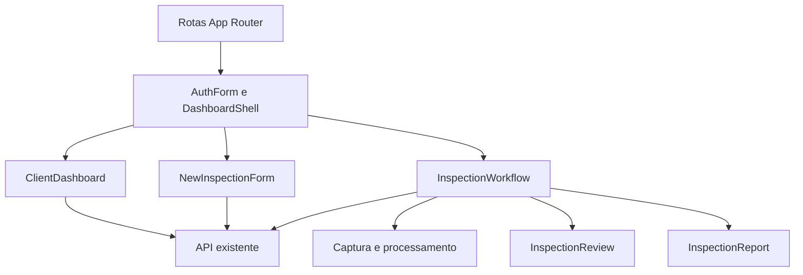

# Interface Lente Operacional Design

**Spec**: `.specs/features/interface-lente-operacional/spec.md`
**Status**: Approved

---

## Architecture Overview

O redesign permanece dentro do frontend Next.js existente. Uma fundação visual global define tokens e padrões; componentes de marca e navegação aplicam a identidade; as features atuais mantêm os contratos e a máquina de estados já testados. Não há mudança de API, persistência ou domínio.



---

## Code Reuse Analysis

### Existing Components to Leverage

| Component | Location | How to Use |
| --- | --- | --- |
| `DashboardShell` | `app/frontend/src/components/DashboardShell.tsx` | Manter roteamento e sessão, substituindo composição e marca. |
| `AuthForm` | `app/frontend/src/features/auth/AuthForm.tsx` | Preservar autenticação e tratamento de erro; aplicar nova narrativa visual. |
| `InspectionWorkflow` | `app/frontend/src/features/inspections/client/inspection-workflow.tsx` | Preservar polling, upload, protocolo e transições. |
| `InspectionReview` | `app/frontend/src/features/inspections/client/inspection-review.tsx` | Preservar decisões e reconciliação; reforçar relação foto-contexto. |
| `InspectionReport` | `app/frontend/src/features/inspections/client/inspection-report.tsx` | Preservar rastreabilidade e impressão; alinhar capa e ações à nova marca. |
| Lucide | `app/frontend/package.json` | Usar o conjunto já instalado, sem adicionar dependência. |

### Integration Points

| System | Integration Method |
| --- | --- |
| Autenticação | `auth-service.ts` e sessão local existentes, sem mudança de payload. |
| Vistorias | `features/inspections/api.ts`, mantendo rotas, estados e `ProblemDetail`. |
| Evidências | `EvidenceImage` continua responsável por carregar a imagem autenticada. |
| Fontes | `next/font` no layout para evitar dependência externa em runtime. |

---

## Components

### BrandMark

- **Purpose**: Exibir a marca aprovada com símbolo que reúne imóvel, varredura e nós de IA.
- **Location**: `app/frontend/src/components/brand/BrandMark.tsx`
- **Interfaces**:
  - `BrandMark({ compact, inverse })` - alterna assinatura completa e versão compacta.
- **Dependencies**: ativo raster com transparência e `next/image`.
- **Reuses**: semântica de link fornecida pelo componente consumidor.

### DashboardShell

- **Purpose**: Unificar navegação desktop e móvel ao redor da tarefa ativa.
- **Location**: `app/frontend/src/components/DashboardShell.tsx`
- **Interfaces**:
  - `DashboardShell({ role, children })` - preserva proteção por papel e logout.
- **Dependencies**: `BrandMark`, `usePathname`, sessão local e Lucide.
- **Reuses**: rotas e comportamento de logout atuais.

### InspectionStage

- **Purpose**: Compor a entrada fotográfica da nova vistoria com imagem contextual honesta, progresso e formulário.
- **Location**: `app/frontend/src/features/inspections/client/new-inspection-form.tsx`
- **Interfaces**:
  - submissão existente por `createInspection(address)`.
- **Dependencies**: ativos autorais e API existente.
- **Reuses**: bloqueio de duplicidade, `ProblemDetail` e redirecionamento atuais.

### OperationalJourney

- **Purpose**: Aplicar o mesmo sistema visual aos estados de captura, processamento, revisão e relatório.
- **Location**: `app/frontend/src/features/inspections/client/`
- **Interfaces**:
  - estados continuam derivados de `InspectionStatus`.
- **Dependencies**: componentes atuais, `EvidenceImage`, protocolo e API.
- **Reuses**: toda a lógica de estado existente; o redesign altera apresentação e microcópia somente quando exigido pela especificação.

---

## Data Models

Nenhum modelo de domínio ou contrato HTTP é alterado. Os únicos novos dados são metadados estáticos de apresentação para as imagens demonstrativas:

```typescript
interface ShowcaseFrame {
  src: string;
  label: string;
  alt: string;
}
```

**Relationships**: `ShowcaseFrame` existe somente na tela de nova vistoria e nunca é persistido ou enviado à API.

---

## Error Handling Strategy

| Error Scenario | Handling | User Impact |
| --- | --- | --- |
| Endereço vazio | Erro inline ligado ao input e anúncio por alerta | Usuário sabe o que corrigir sem perder conteúdo. |
| Criação falha | `ProblemDetail` existente permanece visível no formulário | Endereço digitado é preservado. |
| Upload falha | Item mantém evidência confirmada e ação de retry | Trabalho anterior não desaparece. |
| IA falha | Estado operacional próprio com reenvio | Fotos permanecem salvas. |
| Carregamento falha | `AsyncState` oferece recuperação | Não cria rascunho duplicado. |
| Compartilhamento falha | Feedback contextual existente | Relatório continua consultável e imprimível. |

---

## Risks & Concerns

| Concern | Location (file:line) | Impact | Mitigation |
| --- | --- | --- | --- |
| Folha global monolítica com 3.132 linhas | `app/frontend/src/app/globals.css:1` | Regras antigas podem competir com a nova identidade. | Separar fundações, shell, autenticação e jornada em folhas importadas com ownership explícito. |
| Título da nova vistoria sem medida limitada | `app/frontend/src/features/inspections/client/new-inspection-form.tsx:38` | Colisão com formulário no desktop. | Grid com `minmax(0, ...)`, largura máxima em `ch`, `text-wrap: balance` e testes visuais. |
| Conceito contém fotos antes do upload real | `app/frontend/src/features/inspections/client/new-inspection-form.tsx:35` | Pode parecer evidência do usuário. | Rotular como prévia ilustrativa do roteiro e nunca misturar com `Inspection.imagens`. |
| Rota de relatórios é filtro em query-string | `app/frontend/src/components/DashboardShell.tsx:51` | Estado ativo pode não ser inferido apenas pelo pathname. | Incluir `useSearchParams` ou manter rótulo explícito; não criar rota nova. |
| Fontes Google em build | `app/frontend/src/app/layout.tsx:2` | Build pode exigir rede quando cache ausente. | Manter `next/font` atual e registrar bloqueio real caso ocorra. |

---

## Tech Decisions

| Decision | Choice | Rationale |
| --- | --- | --- |
| Organização de estilos | `globals.css` importa folhas por responsabilidade | Reduz acoplamento sem introduzir CSS-in-JS ou dependência. |
| Marca | Ativo raster transparente produzido a partir do conceito aprovado | Evita desenho aproximado em CSS/SVG e preserva a assinatura escolhida. |
| Paleta | Navy + mineral + turquesa; amarelo-lima funcional | Reflete a aprovação mais recente e separa marca de progresso. |
| Relatório | Documento claro dentro de uma aplicação escura | Melhora leitura e impressão sem quebrar a identidade. |
| Responsividade | CSS mobile-first com comp desktop como contrato visual | Atende uso de campo e corrige o defeito observado em desktop. |
