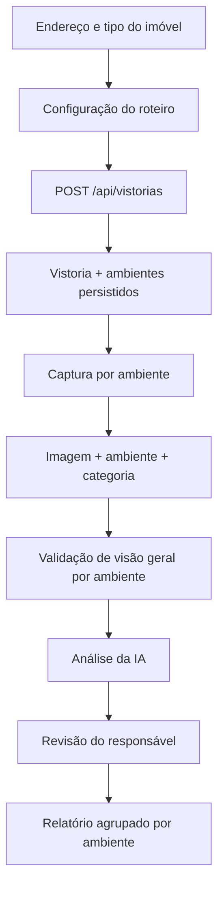

# Interface e roteiro adaptativo Design

**Spec**: `.specs/features/interface-lente-operacional/spec.md`
**Status**: Approved

---

## Architecture Overview

`Vistoria` permanece como raiz do agregado e passa a possuir uma lista ordenada de `AmbienteVistoria`. A evidência referencia um ambiente e uma categoria de captura. O frontend cria o rascunho somente depois que endereço e roteiro foram definidos, usa o roteiro retornado pela API como fonte de verdade e preserva a máquina de estados existente para IA, revisão e relatório.



---

## Code Reuse Analysis

### Existing Components to Leverage

| Component | Location | How to Use |
| --- | --- | --- |
| `Vistoria` | `app/src/main/java/br/com/vistoriapredial/vistoria/domain/` | Continua como agregado e controla estado/concorrência. |
| `ImagemVistoria` | `app/src/main/java/br/com/vistoriapredial/vistoria/domain/` | Mantém storage e passa a referenciar ambiente/categoria. |
| `VistoriaService` | `app/src/main/java/br/com/vistoriapredial/vistoria/application/` | Orquestra criação, edição do roteiro, upload e envio. |
| `EvidenceFileValidator` | `app/src/main/java/br/com/vistoriapredial/vistoria/application/` | Preserva validação de tipo, tamanho e conteúdo. |
| `DashboardShell` | `app/frontend/src/components/` | Preserva sessão e rotas; recebe a nova identidade. |
| `InspectionWorkflow` | `app/frontend/src/features/inspections/client/` | Preserva polling, retry e estados; troca protocolo fixo pelo roteiro da API. |
| `InspectionReview` e `InspectionReport` | `app/frontend/src/features/inspections/client/` | Preservam revisão e impressão; exibem contexto do ambiente. |

### Integration Points

| System | Integration Method |
| --- | --- |
| Banco | Migration V8 cria ambientes e adiciona tipo/categoria; V9 viabiliza reordenação atômica e versionada sem apagar colunas legadas. |
| API | DTOs imutáveis para criação/roteiro; multipart recebe `ambienteId` e `categoria`. |
| IA | O provedor continua recebendo imagens; ambiente e categoria permanecem no agregado e no relatório. |
| Storage | Ordem atual de armazenar, persistir e compensar falha é mantida. |

---

## Components

### AmbienteVistoria

- **Purpose**: Representar um ambiente ordenado e pertencente a uma única vistoria.
- **Location**: `app/src/main/java/br/com/vistoriapredial/vistoria/domain/`
- **Interfaces**:
  - `criar(tipo, nome, ordem)` valida nome e posição.
  - `renomear(tipo, nome, ordem)` altera o roteiro somente via agregado.
- **Dependencies**: `TipoAmbiente`, `Vistoria`.
- **Reuses**: convenções JPA existentes, `@Version` no agregado pai.

### RoteiroVistoriaService

- **Purpose**: Criar e reconciliar a lista de ambientes sem perder evidências.
- **Location**: métodos coesos em `VistoriaService`.
- **Interfaces**:
  - `criarVistoria(cliente, command)` persiste o agregado completo.
  - `atualizarRoteiro(id, cliente, command)` adiciona, renomeia, reordena e remove somente ambientes vazios.
- **Dependencies**: repositório, regras de ownership e status.
- **Reuses**: `salvarComControleConcorrencia` e exceções RFC 9457.

### RouteBuilder

- **Purpose**: Coletar tipo do imóvel e ambientes antes de criar o rascunho.
- **Location**: `app/frontend/src/features/inspections/client/new-inspection-form.tsx`.
- **Interfaces**: envia `CreateInspectionRequest` com lista ordenada.
- **Dependencies**: templates locais de sugestão e API existente.
- **Reuses**: estados de erro e busy state do formulário atual.

### AdaptiveCaptureWorkspace

- **Purpose**: Navegar pelo roteiro persistido e enviar visão geral ou detalhe.
- **Location**: `app/frontend/src/features/inspections/client/inspection-workflow.tsx`.
- **Interfaces**: `uploadEvidence(inspectionId, ambienteId, categoria, file)`.
- **Dependencies**: `Inspection.ambientes`, `Evidence.ambienteId`.
- **Reuses**: upload, retry, polling, análise e `EvidenceImage` atuais.

### BrandMark

- **Purpose**: Exibir a assinatura aprovada sem moldura externa.
- **Location**: `app/frontend/src/components/brand/BrandMark.tsx`.
- **Interfaces**: `BrandMark({ compact, inverse })`.
- **Dependencies**: ativo raster transparente e `next/image`.
- **Reuses**: `next/font` e Lucide já instalados.

---

## Data Models

### Backend

```java
enum TipoImovel { CASA, APARTAMENTO, COMERCIAL, OUTRO }
enum TipoAmbiente { ENTRADA, SALA, COZINHA, BANHEIRO, QUARTO, AREA_SERVICO, VARANDA, GARAGEM, AREA_EXTERNA, ESCRITORIO, OUTRO }
enum CategoriaEvidencia { VISAO_GERAL, DETALHE }

AmbienteVistoria {
  Long id;
  Vistoria vistoria;
  TipoAmbiente tipo;
  String nome;
  int ordem;
}
```

`ImagemVistoria` recebe `AmbienteVistoria ambiente` e `CategoriaEvidencia categoria`. `protocoloItem` permanece somente para leitura legada e recebe um identificador derivado nas evidências novas.

### API

```json
{
  "endereco": "Rua das Acácias, 123",
  "tipoImovel": "APARTAMENTO",
  "ambientes": [
    { "tipo": "SALA", "nome": "Sala" },
    { "tipo": "QUARTO", "nome": "Quarto 1" }
  ]
}
```

```typescript
interface InspectionRoom {
  id: number;
  tipo: RoomType;
  nome: string;
  ordem: number;
}

interface Evidence {
  id: number;
  ambienteId: number | null;
  ambienteNome: string | null;
  categoria: "VISAO_GERAL" | "DETALHE" | null;
  protocoloItem: string;
  dataUpload: string;
  conteudoUrl: string;
}
```

---

## Error Handling Strategy

| Error Scenario | Handling | User Impact |
| --- | --- | --- |
| Roteiro vazio, grande ou duplicado | Bean Validation + regra de aplicação, `422` | Erro permanece associado à configuração. |
| Ambiente não pertence à vistoria | `InvalidEvidenceException`, `422` antes do storage | Nenhum arquivo órfão. |
| Remoção de ambiente com evidências | Exceção de conflito, `409` | Evidências e roteiro permanecem intactos. |
| Envio incompleto | `422` com nomes ausentes | UI leva o usuário diretamente aos ambientes pendentes. |
| Concorrência | `@Version` e `409` | Cliente recarrega o estado mais recente. |
| Upload falha após storage | Compensação existente remove o arquivo | Estado confirmado é preservado. |
| Evidência legada | Fallback por `protocoloItem` | Relatórios existentes continuam legíveis. |

---

## Risks & Concerns

| Concern | Location (file:line) | Impact | Mitigation |
| --- | --- | --- | --- |
| Protocolo duplicado no frontend e backend | `shared/protocol.ts:1`, `ProtocoloVistoria.java:1` | Drift e lista fixa divergente | Substituir por roteiro persistido retornado pela API. |
| Upload grava arquivo antes do banco | `VistoriaService.java:90` | Arquivo órfão em falha | Preservar compensação e validar ambiente antes do storage. |
| IA externa recebe apenas imagem | `VlmIntegrationService.java:42` | Modelo não recebe o nome do ambiente | Não inventar contrato externo; manter metadados para revisão/relatório e registrar como futuro. |
| Folha global monolítica | `app/frontend/src/app/globals.css:1` | Colisões e regressões visuais | Separar fundações e jornadas por responsabilidade. |
| Evidências antigas não têm ambiente | `V2__create_vistoria_schema.sql:13` | Migração não pode tornar FK obrigatória | Nova FK permanece nula para legado; novos casos de uso exigem ambiente. |

---

## Tech Decisions

| Decision | Choice | Rationale |
| --- | --- | --- |
| Raiz do agregado | `Vistoria` controla ambientes e imagens | Ownership, status e concorrência já vivem ali. |
| Criação | Endereço e roteiro são persistidos atomicamente | Evita rascunho sem estrutura. |
| Flexibilidade | Tipos conhecidos + nome livre + `OUTRO` | Permite relatório consistente sem vocabulário fechado. |
| Regra mínima | Uma visão geral por ambiente | Simples, explicável e verificável. |
| Legado | Manter `protocolo_item` e FK de ambiente opcional no schema | Evita migração destrutiva. |
| Paleta | Grafite-petróleo, mineral, verdigris e âmbar | Reduz competição cromática e mantém identidade profissional. |
