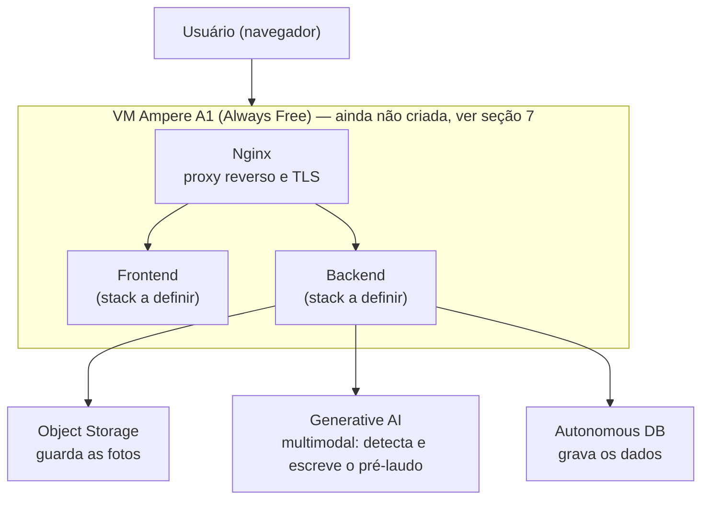
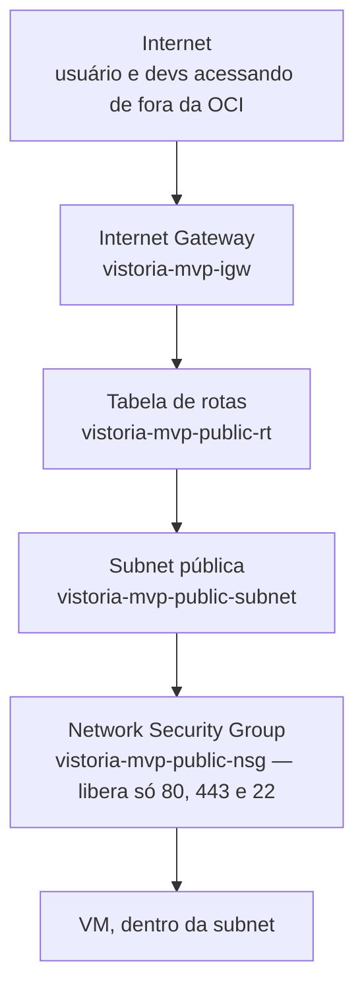
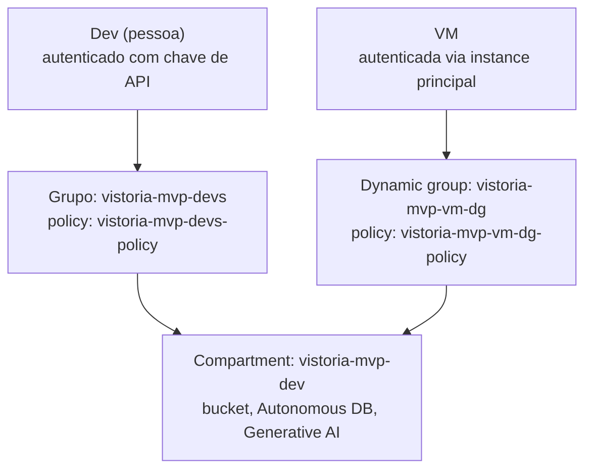

# Vistor.IA (VistorIA)

> Documentação técnica alinhada ao item **3.5** do edital Tech4Change 2026 (repositório e README).

Repositório único do projeto, reunindo o protótipo de produto, a prova de
conceito técnica de IA e a infraestrutura (Terraform + Ansible), com o
histórico de commit completo de cada parte preservado.

```
.
├── prototipo/   # Visão de produto (discovery): protótipo navegável, HTML/CSS/JS
├── app/         # Prova de conceito técnica isolada: "a IA consegue avaliar por foto?"
└── infra/       # Terraform, Ansible e o ambiente real na OCI
```

**Antes de mais nada, um ponto importante para não gerar confusão**: durante
o projeto, o time trabalhou em duas frentes em paralelo, e cada uma virou
uma pasta diferente aqui:

- **`prototipo/`** é o resultado do *discovery* de produto — a experiência
  de usuário desenhada (onboarding, captura guiada, checklist e relatório).
  É a visão do **Vistor.IA** enquanto produto.
- **`app/`** é uma **prova de conceito técnica isolada**, feita por outra
  parte do time em paralelo, para responder a uma única pergunta: **a IA
  consegue avaliar defeitos numa foto de vistoria, ou não?** A stack usada
  ali (Next.js, Spring Boot, PostgreSQL, VLM self-hospedado) foi a
  conveniente para montar esse teste rápido — **não é a stack decidida
  para o produto final, nem a aparência final do app**. Quem baixar e
  rodar `app/` vai ver uma tela e um fluxo que **não têm relação com o
  design do produto** mostrado em `prototipo/`; serve só para comprovar
  (ou não) a viabilidade técnica do núcleo de IA.

## 1. Descrição da solução

**Vistor.IA** é um assistente que conduz a vistoria de apartamento
**cômodo por cômodo**, em conversa com o usuário: a IA orienta o que
fotografar, comenta a qualidade das fotos, destaca possíveis defeitos e
monta um checklist para conferência no local — com formalização em
relatório.

O problema que resolve: vistorias de imóveis (entrega de obra, mudança,
laudo de conservação) hoje dependem inteiramente do olhar humano no
momento da visita, sem um registro estruturado e sem uma primeira leitura
das evidências antes da análise técnica. O Vistor.IA usa um modelo
multimodal para fazer essa pré-leitura das fotos — apontando indícios de
rachadura, mofo, infiltração, falta de acabamento — **antes** da
homologação humana, que continua sendo obrigatória e final.

### Jornada do produto (visão de `prototipo/`)


| Etapa | O que acontece |
| --- | --- |
| **1. Onboarding** | O app explica o que vai acontecer antes de pedir a primeira foto. |
| **2. Captura guiada** | O assistente pede foto por foto e comenta o que encontrou, cômodo a cômodo. |
| **3. Checklist e relatório** | Itens derivados das fotos enviadas, com status (OK, a checar, alerta) e pontos de atenção. |
| **4. Formalizar** | Relatório com fotos e descrições, pronto para envio. |

A decisão técnica e a homologação final permanecem **Human-in-the-Loop**:
a IA sugere, a pessoa (cliente e, no fluxo técnico, o engenheiro) confirma.

### Escopo desta entrega

- **`prototipo/`** — a visão de produto validada no discovery, navegável
  sem instalação: [`prototipo/VistorIA-prototipo-navegavel.html`](prototipo/VistorIA-prototipo-navegavel.html).
- **`app/`** — a prova de conceito técnica de IA (ver aviso acima):
  cadastro, protocolo de evidências, upload, pré-análise por IA (mock ou
  VLM self-hospedado) e fila de revisão humana, ponta a ponta, só para
  validar a viabilidade técnica do núcleo de IA.
- **`infra/`** — o ambiente de nuvem compartilhado na OCI (compartment,
  rede, Object Storage, Autonomous Database e permissões de Generative AI)
  já provisionado — ver seção 7 pro estado exato de cada peça. Essa infra
  ainda não está conectada a `app/` nem a `prototipo/`; é a base para o
  produto final, que ainda será construído a partir do que o discovery e
  a prova de conceito validaram.

## 2. Tecnologias, linguagens e frameworks utilizados

| Camada | Tecnologia | Onde |
| --- | --- | --- |
| Protótipo de produto | HTML, CSS, JavaScript (estático) | `prototipo/` |
| Backend (PoC de IA) | Java 21, Spring Boot 3.2.3, Spring Security + JJWT, Spring Data JPA, Flyway | `app/` — stack de teste, não decisão final |
| Frontend (PoC de IA) | Next.js 16.3.5, React 19, TypeScript | `app/` — stack de teste, não decisão final |
| IA (PoC de IA) | Python/FastAPI, VLM `Qwen/Qwen3-VL-2B-Instruct` self-hospedado (GPU NVIDIA) | `app/` |
| Banco (PoC de IA) | PostgreSQL 16 (Testcontainers) / H2 em memória para dev | `app/` |
| Infraestrutura real | Terraform (`oracle/oci` provider), Ansible | `infra/` |
| Nuvem | Oracle Cloud Infrastructure (OCI): Object Storage, Autonomous Database, Generative AI | `infra/` |

## 3. Arquitetura geral do sistema

### Arquitetura de infraestrutura provisionada (`infra/`)

Isto é o que existe de verdade na nuvem hoje — os nomes "Frontend" e
"Backend" abaixo são as peças que o produto final vai ocupar, ainda
**sem** tecnologia de frontend/backend definitivamente escolhida (ver
aviso no topo do documento):



### Arquitetura da prova de conceito técnica (`app/`, execução local isolada)

Só descreve como `app/` funciona por dentro — não é a arquitetura do
produto final:

```text
Cliente / Engenheiro
        │
        ▼
   Next.js (:3000)
        │  REST + JWT
        ▼
 Spring Boot (:8080)
   ├── H2 / PostgreSQL
   ├── StorageService (arquivos locais)
   └── IaIntegrationService
         ├── mock  → MockIaIntegrationService
         └── vlm   → VlmIntegrationService → inference VLM (:8001)
```

### Arquitetura de rede (OCI, `infra/`)



### Arquitetura de identidade e acesso (OCI, `infra/`)



Detalhamento das fronteiras internas da PoC técnica:
[`app/docs/architecture.md`](app/docs/architecture.md).

## 4. APIs, modelos de IA e bases de dados utilizadas

| Camada | Na prova de conceito técnica (`app/`) | Ambiente OCI provisionado (`infra/`) |
| --- | --- | --- |
| API | REST própria sob `/api` (só para o teste técnico) | A definir junto do produto final |
| Modelo de IA | VLM `Qwen/Qwen3-VL-2B-Instruct` self-hospedado (ou mock) | **OCI Generative AI**, modelo multimodal on-demand (Chat API) |
| Banco de dados | H2 em memória (dev) / PostgreSQL via Testcontainers (testes) | **Oracle Autonomous Database** (Always Free, 26ai) |
| Armazenamento de imagens | Sistema de arquivos local | **OCI Object Storage** (bucket `vistoria-fotos`) |

O modelo de Generative AI validado contra o ambiente real da OCI foi
`meta.llama-4-scout-17b-16e-instruct` — o modelo originalmente cogitado
(`meta.llama-3.2-90b-vision-instruct`) foi descontinuado pela Oracle
durante o desenvolvimento; ver `infra/docs/onboarding-backend-dev.md` para
o histórico dessa descoberta e os scripts que validaram cada serviço
isoladamente (`infra/scripts/smoke-tests/`). Essa validação é sobre o
**serviço da OCI em si**, não sobre `app/` — a prova de conceito em
`app/` usa um modelo diferente (VLM self-hospedado), justamente porque é
um teste isolado, anterior e independente da infraestrutura Oracle.

### Endpoints da API de teste em `app/` (só da prova de conceito técnica)

| Método | Endpoint | Perfil | Descrição |
| --- | --- | --- | --- |
| `POST` | `/api/auth/register` | Público | Cadastra cliente; engenheiro exige convite válido |
| `POST` | `/api/auth/login` | Público | Autentica e retorna JWT |
| `POST` | `/api/vistorias` | Cliente | Cria rascunho com endereço |
| `GET` | `/api/vistorias/minhas` | Cliente | Lista as vistorias do usuário |
| `GET` | `/api/vistorias/{id}` | Cliente/Engenheiro | Busca uma vistoria específica |
| `POST` | `/api/vistorias/{id}/imagens` | Cliente | Envia evidência multipart |
| `POST` | `/api/vistorias/{id}/submeter` | Cliente | Envia ou reenvia para análise |
| `GET` | `/api/vistorias/pendentes` | Engenheiro | Lista a fila técnica |
| `POST` | `/api/vistorias/{id}/analisar` | Engenheiro | Aprova ou devolve com parecer |

## 5. Instruções para instalação ou execução

### Protótipo navegável — visão de produto, sem instalação

Abra [`prototipo/VistorIA-prototipo-navegavel.html`](prototipo/VistorIA-prototipo-navegavel.html)
diretamente no navegador. É a forma mais fiel de ver a proposta do
Vistor.IA como produto.

### Prova de conceito técnica de IA (`app/`) — só para testar se a IA avalia fotos

⚠️ Isto roda **apenas o teste técnico de IA**, não o app final e não a
experiência mostrada no protótipo acima. A tela, o fluxo e o banco de
dados que aparecem aqui são só o necessário para provar a viabilidade
técnica.

**Sem Docker** (perfil padrão: H2 em memória, storage local, pré-laudo
mock):

```powershell
# terminal 1 — backend em http://localhost:8080
cd app
$env:JWT_SECRET = "defina-um-segredo-local-com-pelo-menos-32-bytes"
$env:ENGINEER_REGISTRATION_CODE = "defina-um-convite-para-engenheiros"
.\mvnw.cmd spring-boot:run

# terminal 2 — frontend em http://localhost:3000
cd app/frontend
npm ci
npm run dev
```

**Com Docker, IA real ligada** (**requer GPU NVIDIA** — driver + NVIDIA
Container Toolkit):

```powershell
cd app
copy .env.example .env
docker compose up --build -d
curl http://127.0.0.1:8001/health
```

Jornada de teste: cadastrar cliente → criar vistoria → enviar fotos →
submeter → cadastrar engenheiro com `ENGINEER_REGISTRATION_CODE` → abrir
a fila e conferir o pré-laudo (é aí que se vê se a IA identificou os
defeitos ou não). Detalhes da VLM local:
[`app/inference/README.md`](app/inference/README.md).

### Infraestrutura na OCI (`infra/`)

```bash
cd infra/terraform/environments/dev
cp terraform.tfvars.example terraform.tfvars   # preencher com valores reais, nunca commitar
terraform init
terraform plan
terraform apply
```

Passo a passo completo (chave de API, wallet do banco, testes isolados de
cada serviço): [`infra/docs/spec-ambiente-dev.md`](infra/docs/spec-ambiente-dev.md)
e [`infra/docs/onboarding-backend-dev.md`](infra/docs/onboarding-backend-dev.md).

## 6. Integrantes da equipe e suas respectivas contribuições

| RM | Nome | Contribuição |
| --- | --- | --- |
| rm376917 | Cleivin de Moura Lauermann | Ambiente de IA da prova de conceito técnica e treinamento |
| rm371636 | Vinícius de Oliveira Gonçalves | Frontend e backend da prova de conceito técnica |
| rm376236 | João Batista Santana de Moraes | Infraestrutura, idealização e discovery do produto |

## 7. Limitações conhecidas e próximos passos

### Limitações conhecidas

- **`app/` é uma prova de conceito técnica isolada**, não o app final: ela
  só testa se a IA consegue avaliar defeitos numa foto. A stack usada ali
  (Next.js, Spring Boot, PostgreSQL) não é a decisão de tecnologia do
  produto, e o visual/fluxo não representa a experiência final — isso
  está em `prototipo/`.
- A infraestrutura real na OCI (`infra/`) e a prova de conceito técnica
  (`app/`) **ainda não estão conectadas**: `app/` usa um VLM
  self-hospedado (`Qwen3-VL`) e storage local, não os serviços OCI já
  provisionados.
- **A VM da aplicação ainda não foi criada**: a região `sa-saopaulo-1` está
  sem capacidade disponível do shape Always Free `VM.Standard.A1.Flex`
  (erro `Out of host capacity` da própria OCI, não é falha de
  configuração). Tentativas automáticas de nova criação continuam.
- O acesso ao **OCI Generative AI** teve um limite de conta trial
  (`max-on-demand-chat-request-per-minute-count = 0`) — resolvido após o
  upgrade da conta para Pay As You Go; validar novamente antes de
  considerar essa integração pronta.
- O modelo de IA testado no ambiente OCI ainda não passou por nenhum
  ajuste fino ou treinamento customizado — é o modelo multimodal genérico
  da Oracle (`meta.llama-4-scout-17b-16e-instruct`) usado como veio, sem
  dataset próprio de defeitos de vistoria.
- A prova de conceito técnica com IA local (Docker) exige GPU NVIDIA —
  máquinas sem GPU não sobem o serviço `inference` como está configurado.
- O convite de engenharia em `app/` é um controle administrativo do
  teste, não uma validação automática do CREA.

### Próximos passos

- Definir a stack de frontend/backend do produto final, a partir do que o
  discovery (`prototipo/`) e a prova de conceito técnica (`app/`)
  validaram.
- Destravar a criação da VM (nova tentativa em `sa-saopaulo-1`, ou avaliar
  shape/região alternativos temporariamente).
- Construir o backend do produto final consumindo os serviços já
  provisionados em `infra/` (Object Storage, Generative AI, Autonomous
  Database) — hoje nenhum código de aplicação usa essa infra ainda.
- Rodar o `ansible-playbook` contra a VM assim que ela existir.
- Validar o fluxo ponta a ponta na nuvem (submissão → pré-laudo via OCI
  Generative AI → revisão do engenheiro).
- Avaliar necessidade de fine-tuning ou prompt engineering dedicado para
  melhorar a precisão da detecção de defeitos.

---

Histórico completo de cada parte (commits originais, com autoria
preservada) disponível em [`app/`](app/) e [`infra/`](infra/).
