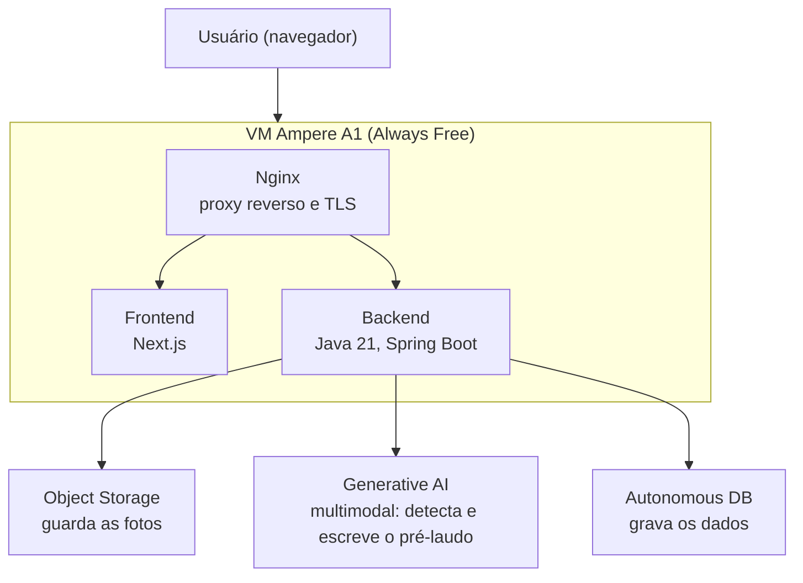
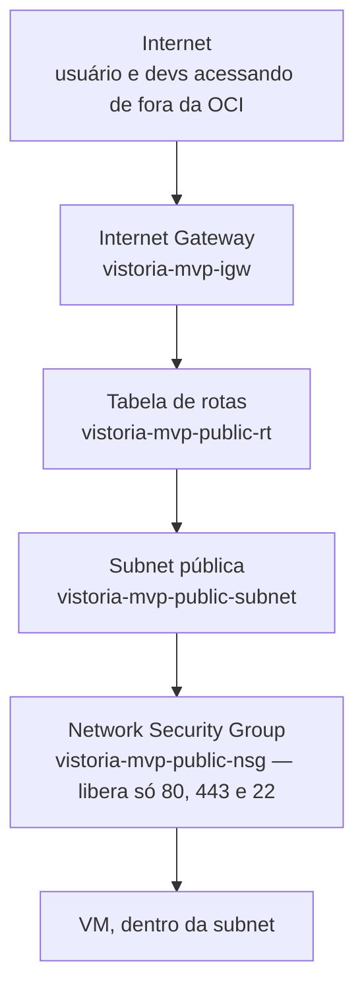
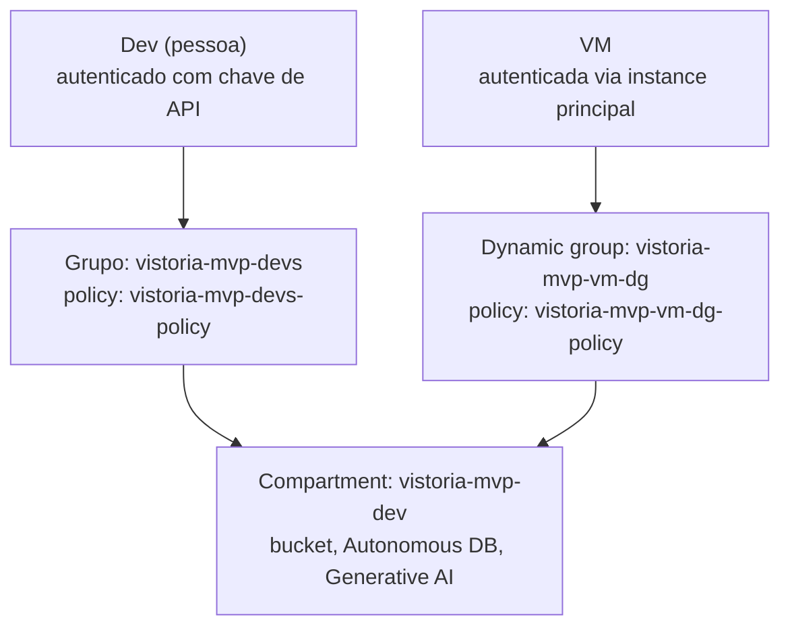

# Vistor.IA (VistorIA)

> Documentação técnica alinhada ao item **3.5** do edital Tech4Change 2026 (repositório e README).

Repositório único do projeto, reunindo infraestrutura (Terraform + Ansible)
e código da aplicação (backend Java/Spring Boot, frontend Next.js, PoC de
IA), com o histórico de commit completo de cada parte preservado.

```
.
├── app/         # Backend, frontend e PoC de IA (histórico original: vistoria-predial)
├── infra/       # Terraform, Ansible e scripts de infra na OCI (histórico original: infra)
└── prototipo/   # Protótipo navegável (visão de produto)
```

## 1. Descrição da solução

**Vistor.IA** é um assistente que conduz a vistoria de apartamento
**cômodo por cômodo**, em conversa com o usuário: a IA orienta o que
fotografar, comenta a qualidade das fotos, destaca possíveis defeitos e
monta um checklist para conferência no local — com formalização em
relatório.

O problema que resolve: vistorias de imóveis (entrega de obra, mudança,
laudo de conservação) hoje dependem inteiramente do olhar humano no
momento da visita, sem um registro estruturado e sem uma primeira leitura
das evidências antes da análise técnica. O Vistor.IA usa um modelo
multimodal para fazer essa pré-leitura das fotos — apontando indícios de
rachadura, mofo, infiltração, falta de acabamento — **antes** da
homologação humana, que continua sendo obrigatória e final.

### Jornada do produto

| Etapa | O que acontece |
| --- | --- |
| **1. Fotografar** | Checklist guiado por cômodo indica o que fotografar em cada ambiente, com orientação em conversa (ex.: avisa se a foto saiu escura ou tremida) e pede ângulos críticos. |
| **2. Detectar** | A IA analisa as fotos e identifica indícios de problemas, anotando no checklist. |
| **3. Verificar** | Conferência ponto a ponto no imóvel: itens OK, a checar, ou com alerta — o que exige inspeção especializada (elétrica/hidráulica) fica marcado como fora do alcance da análise por imagem. |
| **4. Formalizar** | Relatório com fotos e descrições, pronto para envio. |

A decisão técnica e a homologação final permanecem **Human-in-the-Loop**:
a IA sugere, a pessoa (cliente e, no fluxo técnico, o engenheiro) confirma.

### Escopo desta entrega

O que está nesta entrega:
- **Aplicação (PoC técnica)**, em `app/`: cadastro, protocolo de evidências,
  upload, pré-análise por IA (mock ou VLM self-hosted) e fila de revisão
  humana — ponta a ponta, mas ainda sem os serviços gerenciados da Oracle
  plugados no lugar dos mocks locais.
- **Infraestrutura real na OCI**, em `infra/`: o ambiente de nuvem
  compartilhado (compartment, rede, Object Storage, Autonomous Database e
  permissões de Generative AI) já provisionado — ver seção 7 pro estado
  exato de cada peça.
- **Protótipo navegável** da experiência de produto (conversa guiada,
  onboarding, checklist): [`prototipo/VistorIA-prototipo-navegavel.html`](prototipo/VistorIA-prototipo-navegavel.html)
  — independente da PoC técnica, mostra a visão final da interface.

## 2. Tecnologias, linguagens e frameworks utilizados

| Camada | Tecnologia |
| --- | --- |
| Backend | Java 21, Spring Boot 3.2.3, Spring Security + JJWT, Spring Data JPA, Flyway |
| Frontend | Next.js 16.3.5, React 19, TypeScript |
| IA (PoC local) | Python/FastAPI, VLM `Qwen/Qwen3-VL-2B-Instruct` self-hosted (GPU NVIDIA) |
| Banco (PoC local) | PostgreSQL 16 (Testcontainers) / H2 em memória para dev |
| Infraestrutura | Terraform (`oracle/oci` provider), Ansible |
| Testes | JUnit 5, Mockito, Testcontainers, Vitest |
| Nuvem | Oracle Cloud Infrastructure (OCI) |

## 3. Arquitetura geral do sistema

### Arquitetura da aplicação (destino final, na VM da OCI)



### Arquitetura atual da PoC (`app/`, execução local)

```text
Cliente / Engenheiro
        │
        ▼
   Next.js (:3000)
        │  REST + JWT
        ▼
 Spring Boot (:8080)
   ├── H2 / PostgreSQL
   ├── StorageService (arquivos locais)
   └── IaIntegrationService
         ├── mock  → MockIaIntegrationService
         └── vlm   → VlmIntegrationService → inference VLM (:8001)
```

### Arquitetura de rede (OCI)



### Arquitetura de identidade e acesso (OCI)



Detalhamento das fronteiras do backend e frontend:
[`app/docs/architecture.md`](app/docs/architecture.md).

## 4. APIs, modelos de IA e bases de dados utilizadas

| Camada | Nesta PoC (`app/`) | Ambiente OCI provisionado (`infra/`) |
| --- | --- | --- |
| API da aplicação | REST própria sob `/api` | Mesma API, hospedada na VM |
| Modelo de IA | VLM `Qwen/Qwen3-VL-2B-Instruct` self-hosted (ou mock) | **OCI Generative AI**, modelo multimodal on-demand (Chat API) |
| Banco de dados | H2 em memória (dev) / PostgreSQL via Testcontainers (testes) | **Oracle Autonomous Database** (Always Free, 26ai) |
| Armazenamento de imagens | Sistema de arquivos local | **OCI Object Storage** (bucket `vistoria-fotos`) |

O modelo de Generative AI validado contra o ambiente real foi
`meta.llama-4-scout-17b-16e-instruct` — o modelo originalmente cogitado
(`meta.llama-3.2-90b-vision-instruct`) foi descontinuado pela Oracle
durante o desenvolvimento; ver `infra/docs/onboarding-backend-dev.md` para
o histórico dessa descoberta e os scripts que validaram cada serviço
isoladamente (`infra/scripts/smoke-tests/`).

### Endpoints principais da API (`app/`)

| Método | Endpoint | Perfil | Descrição |
| --- | --- | --- | --- |
| `POST` | `/api/auth/register` | Público | Cadastra cliente; engenheiro exige convite válido |
| `POST` | `/api/auth/login` | Público | Autentica e retorna JWT |
| `POST` | `/api/vistorias` | Cliente | Cria rascunho com endereço |
| `GET` | `/api/vistorias/minhas` | Cliente | Lista as vistorias do usuário |
| `GET` | `/api/vistorias/{id}` | Cliente/Engenheiro | Busca uma vistoria específica |
| `POST` | `/api/vistorias/{id}/imagens` | Cliente | Envia evidência multipart |
| `POST` | `/api/vistorias/{id}/submeter` | Cliente | Envia ou reenvia para análise |
| `GET` | `/api/vistorias/pendentes` | Engenheiro | Lista a fila técnica |
| `POST` | `/api/vistorias/{id}/analisar` | Engenheiro | Aprova ou devolve com parecer |

## 5. Instruções para instalação ou execução

### Protótipo navegável (visão de produto, sem instalação)

Abra [`prototipo/VistorIA-prototipo-navegavel.html`](prototipo/VistorIA-prototipo-navegavel.html)
diretamente no navegador.

### PoC técnica — desenvolvimento local sem Docker

Perfil padrão: H2 em memória, storage local, pré-laudo mock.

```powershell
# terminal 1 — backend em http://localhost:8080
cd app
$env:JWT_SECRET = "defina-um-segredo-local-com-pelo-menos-32-bytes"
$env:ENGINEER_REGISTRATION_CODE = "defina-um-convite-para-engenheiros"
.\mvnw.cmd spring-boot:run

# terminal 2 — frontend em http://localhost:3000
cd app/frontend
npm ci
npm run dev
```

### PoC técnica + IA local via Docker

**Requer GPU NVIDIA** (driver + NVIDIA Container Toolkit).

```powershell
cd app
copy .env.example .env
docker compose up --build -d
curl http://127.0.0.1:8001/health
```

Jornada de teste: cadastrar cliente → criar vistoria → enviar fotos →
submeter → cadastrar engenheiro com `ENGINEER_REGISTRATION_CODE` → abrir
a fila e conferir o pré-laudo. Detalhes da VLM local:
[`app/inference/README.md`](app/inference/README.md).

### Infraestrutura na OCI

```bash
cd infra/terraform/environments/dev
cp terraform.tfvars.example terraform.tfvars   # preencher com valores reais, nunca commitar
terraform init
terraform plan
terraform apply
```

Passo a passo completo (chave de API, wallet do banco, testes isolados de
cada serviço): [`infra/docs/spec-ambiente-dev.md`](infra/docs/spec-ambiente-dev.md)
e [`infra/docs/onboarding-backend-dev.md`](infra/docs/onboarding-backend-dev.md).

## 6. Integrantes da equipe e suas respectivas contribuições

| RM | Nome | Contribuição |
| --- | --- | --- |
| rm376917 | Cleivin de Moura Lauermann | Ambiente de IA do MVP e treinamento |
| rm371636 | Vinícius de Oliveira Gonçalves | Frontend e backend |
| rm376236 | João Batista Santana de Moraes | Infraestrutura e idealização do produto |

## 7. Limitações conhecidas e próximos passos

### Limitações conhecidas

- Esta entrega é uma **prova de conceito** focada na pré-análise por IA
  (pré-laudo preliminar), com revisão humana. O código de `app/` ainda usa
  mock ou uma VLM self-hosted (`Qwen3-VL`) — a integração real com o
  **OCI Generative AI** (`OciGenAiIntegrationService`) e com o
  **OCI Object Storage** (`OciObjectStorageService`) ainda não foi
  implementada no backend, embora a infraestrutura de destino já esteja
  no ar (ver `infra/`).
- O banco-alvo do backend hoje é **PostgreSQL/H2**; a migração para o
  **Oracle Autonomous Database** (driver `ojdbc`, dialeto Flyway Oracle,
  ajuste das migrations) ainda não foi feita no código, apesar do banco
  já existir e estar acessível no ambiente OCI.
- **A VM da aplicação ainda não foi criada**: a região `sa-saopaulo-1` está
  sem capacidade disponível do shape Always Free `VM.Standard.A1.Flex`
  (erro `Out of host capacity` da própria OCI, não é falha de
  configuração). Tentativas automáticas de nova criação continuam.
- O acesso ao **OCI Generative AI** teve um limite de conta trial
  (`max-on-demand-chat-request-per-minute-count = 0`) — resolvido após o
  upgrade da conta para Pay As You Go; validar novamente antes de
  considerar essa integração pronta.
- O modelo de IA em produção ainda não passou por nenhum ajuste fino ou
  treinamento customizado — é o modelo multimodal genérico da Oracle
  (`meta.llama-4-scout-17b-16e-instruct`) usado como veio, sem dataset
  próprio de defeitos de vistoria.
- O MVP com IA local (Docker) exige GPU NVIDIA — máquinas sem GPU não
  sobem o serviço `inference` como está configurado.
- O convite de engenharia é um controle administrativo do MVP, não uma
  validação automática do CREA.

### Próximos passos

- Destravar a criação da VM (nova tentativa em `sa-saopaulo-1`, ou avaliar
  shape/região alternativos temporariamente).
- Implementar `OciObjectStorageService` e `OciGenAiIntegrationService` no
  backend, substituindo os adaptadores locais/mock pelos serviços já
  provisionados em `infra/`.
- Migrar o schema e o driver do backend de PostgreSQL/H2 para o Oracle
  Autonomous Database.
- Rodar o `ansible-playbook` contra a VM assim que ela existir, subindo a
  aplicação real no ambiente compartilhado.
- Validar o fluxo ponta a ponta na nuvem (submissão → pré-laudo via OCI
  Generative AI → revisão do engenheiro), fora do compose local.
- Avaliar necessidade de fine-tuning ou prompt engineering dedicado para
  melhorar a precisão da detecção de defeitos.

---

Histórico completo de cada parte (commits originais, com autoria
preservada) disponível em [`app/`](app/) e [`infra/`](infra/).
