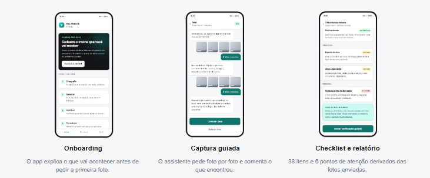
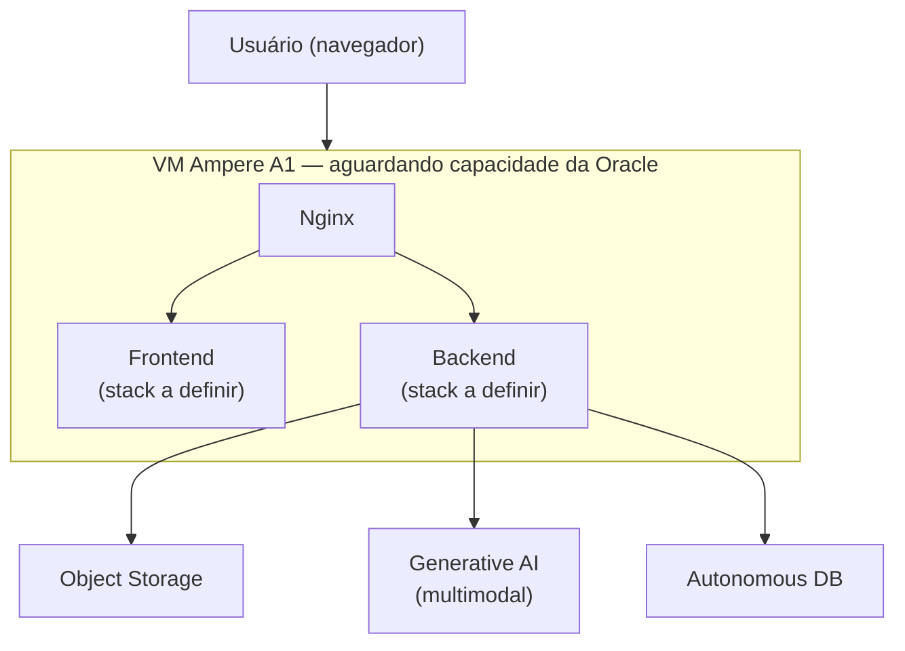
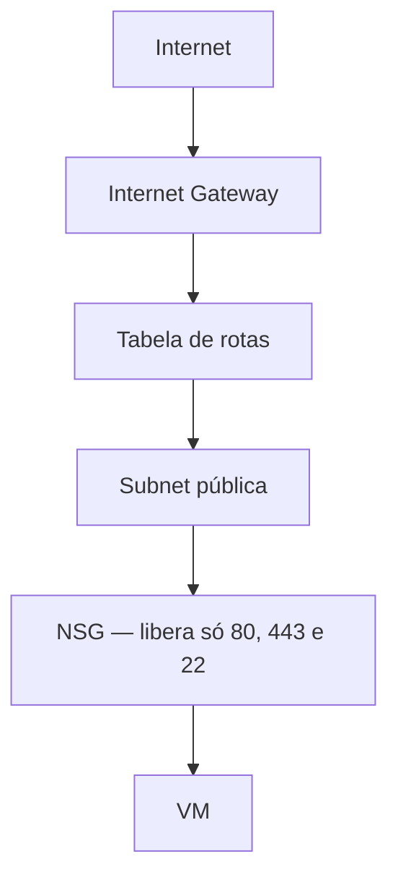
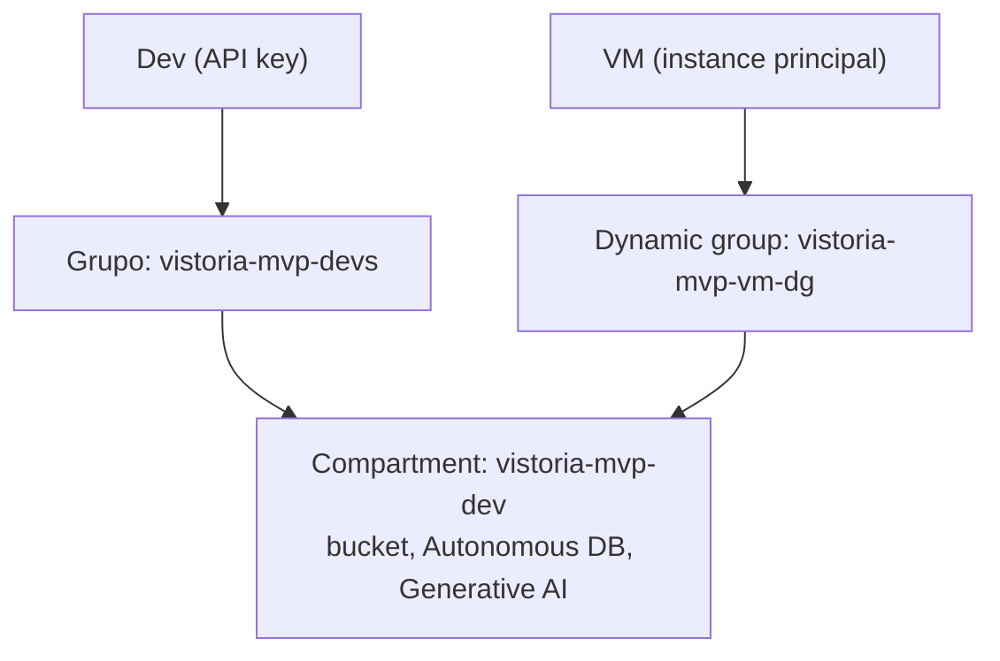

# Vistor.IA (VistorIA)



**Vistor.IA** é um assistente que conduz a vistoria de imóvel cômodo por
cômodo, usando IA para pré-analisar fotos e apontar defeitos antes da
homologação humana.

🔗 **[Protótipo navegável](https://ia-vistoria.github.io/vistoria-mvp/prototipo/VistorIA-prototipo-navegavel.html)**

## Status atual do projeto

- ✅ MVP navegável (protótipo) pronto e validado.
- ✅ Uso da IA para avaliação de fotos validado localmente (prova de conceito técnica).
- ✅ Infraestrutura de nuvem provisionada na Oracle (rede, banco de dados, armazenamento de imagens).
- ⏳ Generative AI (IA/Vision) da Oracle: ainda em validação — pendência de cota da conta.
- ⏳ Instância (VM) da aplicação: aguardando liberação de capacidade da Oracle (limite do provedor).

## Estrutura do repositório

```
.
├── prototipo/   # Visão de produto (discovery): protótipo navegável
├── app/         # Prova de conceito técnica isolada: "a IA consegue avaliar por foto?"
└── infra/       # Terraform, Ansible e o ambiente real na OCI
```

`prototipo/` é a experiência de produto desenhada no discovery. `app/` é
uma prova de conceito técnica **separada**, feita em paralelo, só para
testar se a IA consegue avaliar defeitos numa foto — a stack usada ali
(Next.js, Spring Boot, PostgreSQL) não é a decisão de tecnologia do
produto nem representa sua aparência final.

## 1. Descrição da solução

Vistorias de imóveis hoje dependem só do olhar humano no momento da
visita, sem um registro estruturado nem uma primeira leitura das
evidências. O Vistor.IA usa um modelo multimodal para pré-analisar as
fotos — apontando indícios de rachadura, mofo, infiltração, falta de
acabamento — antes da homologação humana, que continua obrigatória e
final (fluxo Human-in-the-Loop).

## 2. Tecnologias, linguagens e frameworks utilizados

| Camada | Tecnologia | Onde |
| --- | --- | --- |
| Protótipo de produto | HTML, CSS, JavaScript | `prototipo/` |
| Backend (PoC de IA) | Java 21, Spring Boot, Spring Security, JPA, Flyway | `app/` |
| Frontend (PoC de IA) | Next.js, React, TypeScript | `app/` |
| IA (PoC de IA) | Python/FastAPI, VLM `Qwen/Qwen3-VL-2B-Instruct` self-hospedado | `app/` |
| Banco (PoC de IA) | PostgreSQL / H2 | `app/` |
| Infraestrutura real | Terraform (`oracle/oci`), Ansible | `infra/` |
| Nuvem | OCI: Object Storage, Autonomous Database, Generative AI | `infra/` |

## 3. Arquitetura geral do sistema

### Infraestrutura provisionada na OCI



### Rede e identidade (OCI)





Detalhes: [`infra/README.md`](infra/README.md) · [`app/docs/architecture.md`](app/docs/architecture.md).

## 4. APIs, modelos de IA e bases de dados utilizadas

| Camada | Na PoC técnica (`app/`) | Ambiente OCI (`infra/`) |
| --- | --- | --- |
| Modelo de IA | VLM `Qwen/Qwen3-VL-2B-Instruct` self-hospedado | **OCI Generative AI** (`meta.llama-4-scout-17b-16e-instruct`) |
| Banco de dados | PostgreSQL / H2 | **Oracle Autonomous Database** (Always Free, 26ai) |
| Armazenamento | Sistema de arquivos local | **OCI Object Storage** |

Detalhes da validação do modelo de IA e scripts de teste isolado:
[`infra/docs/onboarding-backend-dev.md`](infra/docs/onboarding-backend-dev.md).

## 5. Instruções para instalação ou execução

> As instruções abaixo rodam a **prova de conceito técnica** (`app/`) —
> como testar localmente se a IA consegue avaliar fotos. O protótipo de
> produto não precisa de instalação: é só abrir o
> [link navegável](https://ia-vistoria.github.io/vistoria-mvp/prototipo/VistorIA-prototipo-navegavel.html).

**Sem Docker** (H2 em memória, pré-laudo mock):

```powershell
cd app
$env:JWT_SECRET = "defina-um-segredo-local-com-pelo-menos-32-bytes"
$env:ENGINEER_REGISTRATION_CODE = "defina-um-convite-para-engenheiros"
.\mvnw.cmd spring-boot:run    # backend em :8080

cd app/frontend
npm ci && npm run dev         # frontend em :3000
```

**Com Docker, IA real ligada** (requer GPU NVIDIA):

```powershell
cd app
copy .env.example .env
docker compose up --build -d
curl http://127.0.0.1:8001/health
```

Jornada de teste: cadastrar cliente → criar vistoria → enviar fotos →
submeter → cadastrar engenheiro (`ENGINEER_REGISTRATION_CODE`) → abrir a
fila e conferir o pré-laudo. Detalhes: [`app/inference/README.md`](app/inference/README.md).

**Infraestrutura na OCI:**

```bash
cd infra/terraform/environments/dev
cp terraform.tfvars.example terraform.tfvars
terraform init && terraform plan && terraform apply
```

Passo a passo completo: [`infra/docs/spec-ambiente-dev.md`](infra/docs/spec-ambiente-dev.md).

## 6. Integrantes da equipe e suas respectivas contribuições

| RM | Nome | Contribuição |
| --- | --- | --- |
| rm376917 | Cleivin de Moura Lauermann | Ambiente de IA da prova de conceito técnica e treinamento |
| rm371636 | Vinícius de Oliveira Gonçalves | Frontend e backend da prova de conceito técnica |
| rm376236 | João Batista Santana de Moraes | Infraestrutura, idealização e discovery do produto |

## 7. Limitações conhecidas e próximos passos

- `app/` é uma prova de conceito isolada — não é o app final nem a stack decidida.
- `infra/` e `app/` ainda não estão conectados.
- VM ainda não criada (capacidade Ampere A1 indisponível na OCI no momento).
- Generative AI: limite de conta trial resolvido após upgrade, revalidar antes de considerar pronto.
- Modelo de IA sem fine-tuning ou dataset próprio de defeitos de vistoria.
- PoC com IA local exige GPU NVIDIA.
- Convite de engenharia é controle administrativo do teste, não validação de CREA.

**Próximos passos:** destravar a VM, construir o backend do produto final
sobre a infra já provisionada, migrar de PostgreSQL para o Autonomous DB,
rodar o Ansible contra a VM, validar o fluxo ponta a ponta na nuvem.
