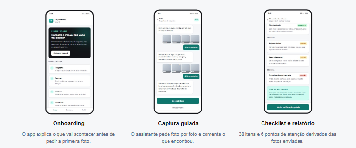
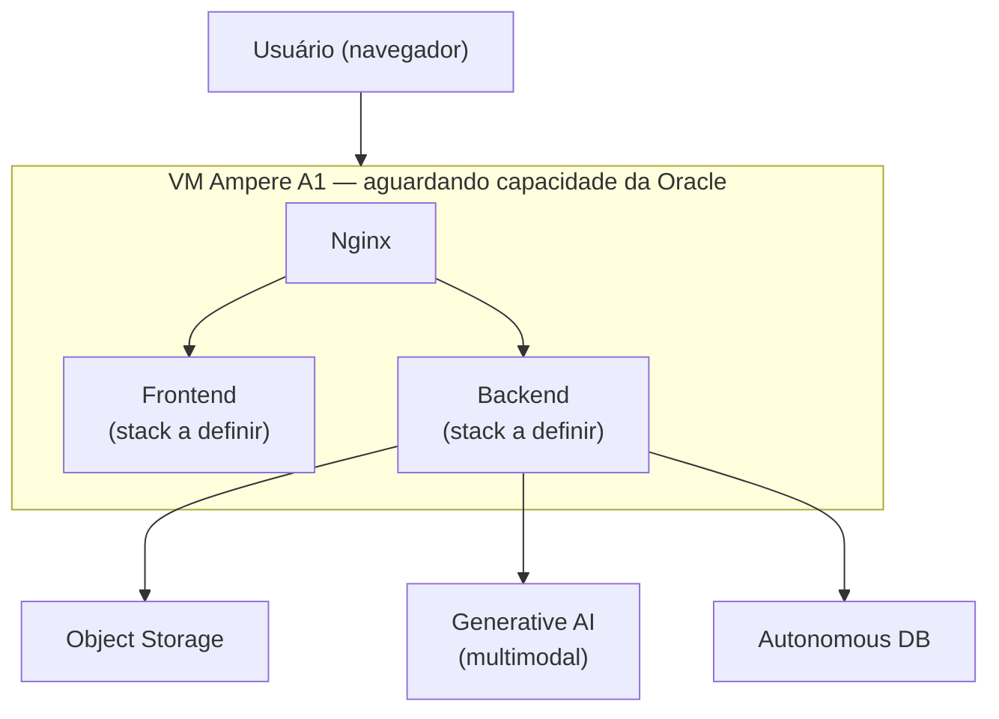
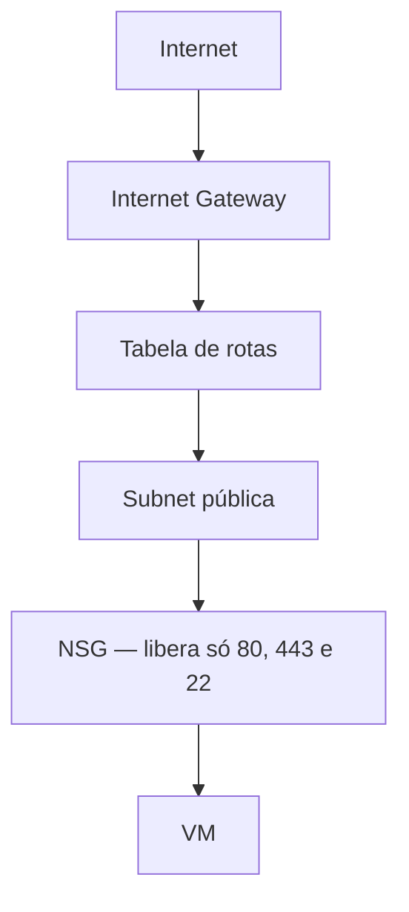
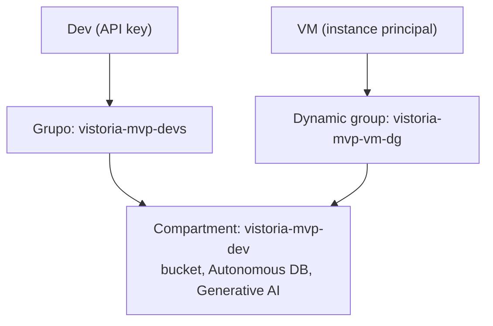

# Vistor.IA (VistorIA)



**Vistor.IA** conduz o registro de um imóvel ambiente por ambiente e transforma
fotos em um **Relatório de vistoria por IA**. A IA produz uma conclusão
automatizada por ambiente, explica os motivos e mantém cada achado ligado à
evidência original. O usuário pode acrescentar contexto ou contestar a leitura,
mas sua manifestação não sobrescreve o resultado da IA.

🔗 **[Protótipo navegável](https://ia-vistoria.github.io/vistoria-mvp/prototipo/VistorIA-prototipo-navegavel.html)**

## Status atual do projeto

- ✅ Jornada principal implementada em `app/`: acesso, imóvel, captura guiada, análise assíncrona, revisão e relatório.
- ✅ Interface responsiva e relatório preparado para impressão ou PDF pelo navegador.
- ✅ Contrato de análise v2, decisão automatizada por ambiente e relatório rastreável validados localmente.
- ✅ Infraestrutura de nuvem provisionada na Oracle (rede, banco de dados, armazenamento de imagens).
- ⏳ Generative AI (IA/Vision) da Oracle: ainda em validação — pendência de cota da conta.
- ⏳ Instância (VM) da aplicação: aguardando liberação de capacidade da Oracle (limite do provedor).

## Estrutura do repositório

```
.
├── prototipo/   # Referência histórica do discovery
├── app/         # MVP executável: frontend, backend, persistência e integração de IA
└── infra/       # Terraform, Ansible e o ambiente real na OCI
```

`prototipo/` preserva o material de discovery. A fonte atual do produto é
`app/`, com Next.js no frontend e Java/Spring Boot no backend. O fluxo antigo
de engenharia continua isolado apenas para compatibilidade; ele não é o
destino da jornada principal do MVP.

## 1. Descrição da solução

Vistorias de imóveis frequentemente ficam dispersas entre fotos e anotações.
O Vistor.IA cria um roteiro flexível a partir dos ambientes que realmente
existem no imóvel, usa um modelo multimodal para analisar cada evidência e
deriva resultados padronizados por ambiente e para o imóvel. A manifestação
do usuário é registrada separadamente. O documento é rastreável, mas não é
laudo técnico, diagnóstico estrutural, certificação profissional nem promessa
de validade jurídica automática.

## 2. Tecnologias, linguagens e frameworks utilizados

| Camada | Tecnologia | Onde |
| --- | --- | --- |
| Protótipo de produto | HTML, CSS, JavaScript | `prototipo/` |
| Backend do MVP | Java 21, Spring Boot, Spring Security, JPA, Flyway | `app/` |
| Frontend do MVP | Next.js, React, TypeScript | `app/frontend/` |
| Análise visual | OCI Generative AI com Gemini via SDK oficial; mock somente em `test`/`demo`; VLM legado opt-in | `app/` |
| Persistência | PostgreSQL como alvo e H2 para desenvolvimento local | `app/` |
| Infraestrutura real | Terraform (`oracle/oci`), Ansible | `infra/` |
| Nuvem | OCI: Object Storage, Autonomous Database, Generative AI | `infra/` |

## 3. Arquitetura geral do sistema

### Infraestrutura provisionada na OCI


```mermaid
flowchart TD
    User["Usuário (navegador)"] --> VMBox

    subgraph VMBox["VM Ampere A1 — aguardando capacidade da Oracle"]
        Nginx["Nginx"]
        Frontend["Frontend<br/>(stack a definir)"]
        Backend["Backend<br/>(stack a definir)"]
        Nginx --> Frontend
        Nginx --> Backend
    end

    Backend --> ObjStorage["Object Storage"]
    Backend --> GenAI["Generative AI<br/>(multimodal)"]
    Backend --> ADB["Autonomous DB"]
```

### Rede e identidade (OCI)


```mermaid
flowchart TD
    A["Internet"] --> B["Internet Gateway"]
    B --> C["Tabela de rotas"]
    C --> D["Subnet pública"]
    D --> E["NSG — libera só 80, 443 e 22"]
    E --> F["VM"]
```


```mermaid
flowchart TD
    Dev["Dev (API key)"] --> GroupDevs["Grupo: vistoria-mvp-devs"]
    VM["VM (instance principal)"] --> DG["Dynamic group: vistoria-mvp-vm-dg"]
    GroupDevs --> Compartment["Compartment: vistoria-mvp-dev<br/>bucket, Autonomous DB, Generative AI"]
    DG --> Compartment
```

Detalhes: [`infra/README.md`](infra/README.md) · [`app/docs/architecture.md`](app/docs/architecture.md).

## 4. APIs, modelos de IA e bases de dados utilizadas

| Camada | No MVP (`app/`) | Ambiente OCI (`infra/`) |
| --- | --- | --- |
| Modelo de IA | **OCI Generative AI** com `google.gemini-2.5-flash` configurável | Mesmo serviço, com `config_file` no desenvolvimento e `instance_principal` no workload OCI |
| Banco de dados | PostgreSQL / H2 | **Oracle Autonomous Database** (Always Free, 26ai) |
| Armazenamento | Sistema de arquivos local | **OCI Object Storage** |

Detalhes da validação do modelo de IA e scripts de teste isolado:
[`infra/docs/onboarding-backend-dev.md`](infra/docs/onboarding-backend-dev.md).

## 5. Instruções para instalação ou execução

> As instruções abaixo executam o MVP local com análise simulada. O protótipo
> histórico continua disponível no
> [link navegável](https://ia-vistoria.github.io/vistoria-mvp/prototipo/VistorIA-prototipo-navegavel.html).

**Sem Docker — demonstração local sem chamada externa** (H2 e fixture mock v2):

```powershell
cd app
$env:JWT_SECRET = "defina-um-segredo-local-com-pelo-menos-32-bytes"
$env:SPRING_PROFILES_ACTIVE = "demo"
$env:APP_IA_PROVIDER = "mock"
.\mvnw.cmd spring-boot:run    # backend em :8080

cd app/frontend
npm ci && npm run dev         # frontend em :3000
```

**Com Docker e OCI Generative AI** (`config_file` local):

```powershell
cd app
copy .env.example .env
docker compose -f docker-compose.yml -f docker-compose.oci-config.yml up --build -d
```

Preencha `OCI_COMPARTMENT_ID` e `OCI_CONFIG_DIR` no `.env`. O arquivo
`~/.oci/config` e a chave privada permanecem fora do repositório e são montados
somente para leitura. Na OCI, use `OCI_AUTH_MODE=instance_principal` e execute o
compose base sem o override de credenciais. O provider VLM legado continua
disponível com `docker compose --profile vlm up --build`, desde que
`APP_IA_PROVIDER=vlm` seja definido explicitamente.

Jornada de teste: criar conta → definir os ambientes → enviar uma visão geral
por ambiente → submeter à IA → consultar o resultado e, se necessário,
registrar uma manifestação → imprimir ou compartilhar o relatório. O smoke
real da OCI é opt-in porque usa credenciais e pode consumir créditos:
[`app/docs/oci-genai-smoke.md`](app/docs/oci-genai-smoke.md).

**Infraestrutura na OCI:**

```bash
cd infra/terraform/environments/dev
cp terraform.tfvars.example terraform.tfvars
terraform init && terraform plan && terraform apply
```

Passo a passo completo: [`infra/docs/spec-ambiente-dev.md`](infra/docs/spec-ambiente-dev.md).

## 6. Integrantes da equipe e suas respectivas contribuições

| RM | Nome | Contribuição |
| --- | --- | --- |
| rm376917 | Cleivin de Moura Lauermann | Ambiente de IA da prova de conceito técnica e treinamento |
| rm371636 | Vinícius de Oliveira Gonçalves | Frontend e backend da prova de conceito técnica |
| rm376236 | João Batista Santana de Moraes | Infraestrutura, idealização e discovery do produto |

## 7. Limitações conhecidas e próximos passos

- O adaptador OCI está implementado, mas o smoke real depende de acesso, cota e configuração da conta do time.
- VM ainda não criada (capacidade Ampere A1 indisponível na OCI no momento).
- Generative AI: limite de conta trial resolvido após upgrade, revalidar antes de considerar pronto.
- Modelo de IA sem fine-tuning ou dataset próprio de defeitos de vistoria.
- O provider VLM legado exige GPU NVIDIA quando utilizado.
- A área de engenharia é um fluxo legado e não integra a jornada principal do MVP.
- O relatório organiza evidências assistidas por IA e não substitui avaliação profissional quando ela for necessária.

**Próximos passos:** conectar o MVP à infraestrutura provisionada, validar a
integração de IA no ambiente-alvo e definir a estratégia de persistência na OCI.
