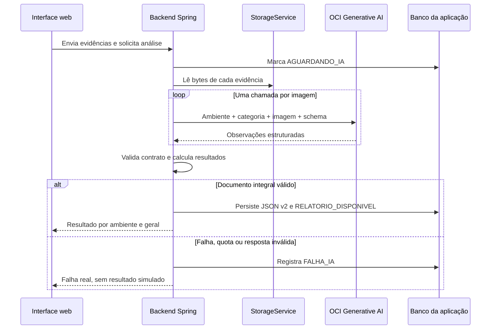

# IA autoral e relatório verificável — Desenho técnico

**Spec:** `.specs/features/ia-laudo-autoral/spec.md`  
**Context:** `.specs/features/ia-laudo-autoral/context.md`  
**Status:** Approved  
**Date:** 30 de setembro de 2026

**Approved by user:** 30 de setembro de 2026. A aprovação inclui a adoção do
Gemini via OCI e a inclusão das dependências oficiais do OCI Java SDK.

## 1. Resumo da decisão

O aplicativo continuará usando a infraestrutura OCI preparada pelo grupo. O
backend Java chamará o **OCI Generative AI Inference** com autenticação local
por arquivo de configuração ou, na VM, por Instance Principal. O modelo inicial
será o `google.gemini-2.5-flash`, consumido sob demanda pelo endpoint da Oracle
em `sa-saopaulo-1`.

Portanto, não haverá troca da Oracle pelo Google: a Oracle continua sendo a
borda de autenticação, autorização, região, cota e consumo. O Gemini é apenas o
modelo multimodal selecionado dentro desse serviço. O identificador permanece
configurável para permitir substituição futura sem reescrever a regra de
negócio.

O desenho também corrige a responsabilidade do produto: a IA gera uma análise
visual automatizada e um resultado por ambiente e geral. O responsável pelo
imóvel pode acrescentar contexto ou contestar, mas não edita nem remove a
conclusão original.

## 2. Estado atual que será preservado

- A porta `IaIntegrationService` continua sendo a fronteira da aplicação com o
  provedor de IA.
- `VistoriaAnalysisProcessor` continua coordenando carregamento, análise,
  validação e persistência sem colocar regra no controller.
- `StorageService` continua abstraindo onde os arquivos estão armazenados.
- O JSON da análise permanece a fonte persistida do documento produzido pela
  IA, agora com versão 2 e metadados de execução.
- A versão 1 continuará legível para vistorias antigas.
- O serviço Qwen e o mock permanecem apenas como referência técnica, testes ou
  demonstração explicitamente identificada; não serão fallback do OCI.
- Região, compartment, dynamic group e policies definidos em `infra/` serão
  reutilizados por configuração.

## 3. Fluxo proposto



Uma chamada por imagem segue o desenho de infraestrutura do grupo, mantém a
origem de cada achado inequívoca e limita o impacto de uma evidência grande. A
consolidação é feita no backend, não por uma segunda chamada ao modelo.

## 4. Fronteiras e componentes

### 4.1 Contrato da aplicação

A porta deixa de receber apenas caminhos soltos e passa a receber contexto de
domínio suficiente para impedir observações genéricas ou trocadas de cômodo:

```java
public interface IaIntegrationService {
    String analisar(SolicitacaoAnaliseIa solicitacao);
}

public record SolicitacaoAnaliseIa(
        Long vistoriaId,
        List<EvidenciaAnaliseIa> evidencias) {
}

public record EvidenciaAnaliseIa(
        Long imagemId,
        Long ambienteId,
        String ambienteNome,
        CategoriaEvidencia categoria,
        String storagePath,
        String contentType) {
}
```

O retorno continua sendo JSON antes do parser para manter o provedor externo
como entrada não confiável. Apenas `PreLaudoParser` pode convertê-lo no contrato
canônico aceito pela aplicação.

### 4.2 Adaptador OCI

Novo pacote: `br.com.vistoriapredial.integration.oci.genai`.

Responsabilidades de `OciGenAiIntegrationService`:

1. validar configuração do provedor;
2. carregar cada imagem por `StorageService`;
3. validar tipo e tamanho antes do envio;
4. montar mensagem multimodal com nome do ambiente, categoria da evidência,
   instruções em português e imagem em data URI;
5. exigir saída JSON por schema estrito;
6. converter a resposta OCI para o JSON canônico v2;
7. classificar falhas sem produzir resposta substituta.

O adaptador não calcula aprovação, não persiste entidades e não conhece
controllers.

### 4.3 Configuração e autenticação

`OciGenAiConfiguration` criará um único cliente oficial por aplicação:

- `OCI_AUTH_MODE=config_file`: usa profile de `~/.oci/config` em
  desenvolvimento;
- `OCI_AUTH_MODE=instance_principal`: usa o dynamic group e as policies da VM;
- `OCI_REGION=sa-saopaulo-1` como default explícito do ambiente;
- `OCI_COMPARTMENT_ID` obrigatório;
- `OCI_GENAI_MODEL_ID=google.gemini-2.5-flash` como configuração inicial;
- timeouts explícitos de conexão e leitura;
- tentativas limitadas apenas para 429, timeout e 5xx recuperável.

401, 403, 404, schema inválido e erro de autenticação não serão repetidos. O
SDK possui política própria de retry; ela será sobrescrita por uma política
menor para evitar chamadas caras ou longas em excesso.

Essa decisão substitui, apenas para Generative AI, a antiga preferência por
`RestClient` registrada em `AD-002`: o SDK oficial resolve assinatura OCI,
Instance Principal e modelos multimodais com menos código de segurança próprio.

### 4.4 Seleção do provedor

`app.ia.provider=oci` será a configuração demonstrável. Implementações serão
selecionadas por propriedade:

- `oci`: integração real;
- `vlm`: execução local explicitamente escolhida;
- `mock`: somente perfis `test` ou `demo`, com guarda que impede inicialização
  em ambiente comum.

Não haverá fallback automático entre provedores. Uma indisponibilidade do OCI
é uma falha operacional visível, não autorização para fabricar um resultado.

## 5. Contrato canônico da análise v2

O modelo descreve evidências e achados. O backend valida, associa identidades
conhecidas e deriva os resultados. Estrutura resumida:

```json
{
  "version": 2,
  "execution": {
    "provider": "oci",
    "model": "google.gemini-2.5-flash",
    "promptVersion": "vistoria-visual-v2",
    "analysisId": "...",
    "completedAt": "..."
  },
  "images": [
    {
      "imageId": 31,
      "storagePath": "...",
      "environment": {
        "id": 8,
        "name": "Banheiro",
        "category": "VISAO_GERAL"
      },
      "imageQuality": "SUFICIENTE",
      "summary": "...",
      "limitations": [],
      "captureGuidance": null,
      "findings": [
        {
          "criterion": "Superfície e sinais de umidade",
          "area": "Parede próxima ao teto",
          "type": "UMIDADE_OU_MOFO_APARENTE",
          "description": "Áreas escurecidas e irregulares...",
          "evidence": "Manchas extensas com padrão não uniforme...",
          "impact": "Pode indicar degradação do revestimento...",
          "severity": "ALTA",
          "confidence": "ALTA",
          "recommendation": "Solicitar avaliação da origem da umidade...",
          "location": "Parede ao fundo"
        }
      ]
    }
  ],
  "environments": [
    {
      "id": 8,
      "name": "Banheiro",
      "result": "NAO_APROVADO",
      "resultReason": "Foi identificado indício visual de alta gravidade..."
    }
  ],
  "overallResult": "NAO_APROVADO",
  "overallReason": "Ao menos um ambiente possui achado de alta gravidade."
}
```

Campos livres terão limites explícitos e listas fechadas. O parser rejeitará o
documento completo se houver ambiente/imagem inexistente, enum desconhecido,
texto obrigatório vazio ou mais de 100 achados. Não haverá truncamento
silencioso.

## 6. Regra determinística de resultado

`ResultadoAnaliseCalculator` será uma regra de aplicação pura e testável. O
modelo informa qualidade, achados, gravidade e justificativas; o backend é quem
converte isso nos quatro estados oficiais:

| Condição do ambiente | Resultado |
| --- | --- |
| Nenhuma evidência suficiente | `INCONCLUSIVO` |
| Ao menos um achado `ALTA` ou `CRITICA` | `NAO_APROVADO` |
| Achados apenas `BAIXA` ou `MEDIA` | `APROVADO_COM_RESSALVAS` |
| Evidências suficientes sem achados | `APROVADO` |

O resultado geral usa a condição mais restritiva nesta ordem:
`NAO_APROVADO`, `INCONCLUSIVO`, `APROVADO_COM_RESSALVAS`, `APROVADO`.

Assim, a IA continua responsável pelo conteúdo analítico, mas um texto livre
do modelo não consegue inventar ou contradizer a transição oficial.

## 7. Estados da vistoria e consistência

- sucesso válido: `AGUARDANDO_IA → RELATORIO_DISPONIVEL`;
- falha técnica ou contrato inválido: `AGUARDANDO_IA → FALHA_IA`;
- nova tentativa permitida somente a partir da execução esperada e com
  controle otimista existente;
- uma análise repetida com o mesmo identificador não duplica achados;
- não haverá estado obrigatório de aprovação pelo responsável.

O processamento não manterá transação de banco aberta durante leitura do
arquivo ou chamada externa. A persistência final revalida estado e versão para
evitar sobrescrita concorrente.

## 8. Manifestação humana

A tela atual de “decisão do responsável” será substituída por “Resultado por
ambiente”. As ações opcionais serão:

- `Concordo`;
- `Contestar análise`, com justificativa obrigatória;
- `Adicionar contexto`.

A manifestação ficará vinculada a `imagemId + indiceAchado` e será exibida em
bloco separado. Tipo, descrição, gravidade, confiança e resultado da IA nunca
serão reescritos. Valores legados `CONFIRMADO`, `CORRIGIDO` e `REJEITADO`
continuam legíveis como histórico, sem excluir achados do relatório v2.

Como as manifestações e a análise já são persistidas em JSON textual, esta
mudança não exige migration destrutiva. Qualquer normalização futura será uma
feature separada.

## 9. Relatório e experiência

O relatório ficará disponível assim que a análise válida terminar. A ordem de
leitura será:

1. identificação e escopo da análise visual automatizada;
2. resultado geral e motivo;
3. resumo por resultado e gravidade;
4. ambientes, cada um com resultado próprio;
5. evidências e achados daquele ambiente;
6. limitações e orientação de nova captura quando inconclusivo;
7. manifestações do responsável em seção separada;
8. provedor, modelo, versão do prompt, análise e data de conclusão.

O texto “stain” deixa de ser exibido como rótulo cru. A taxonomia da aplicação
usa termos compreensíveis em português e a descrição explica: o que foi
observado, onde, qual critério foi avaliado, por que afeta o resultado, qual o
impacto possível e qual a próxima ação prudente.

## 10. Limites de imagem e privacidade

O Gemini 2.5 Flash no OCI aceita imagens multimodais, mas o adaptador precisa
respeitar formato e limite do provedor. Para o MVP:

- formatos enviados: JPEG, PNG e WebP;
- limite de envio ao modelo: 7 MB por imagem antes da codificação;
- uploads maiores não serão enviados silenciosamente: a interface e a API
  informarão o limite compatível com a análise;
- nenhuma imagem ou data URI será registrada em log;
- o primeiro smoke test real usará somente fixture controlada e não pessoal;
- a documentação do produto informará que o modelo Gemini é hospedado
  externamente à OCI, com processamento indicado pela Oracle na localidade do
  Google no Brasil.

O alinhamento de retenção, base legal e aviso de privacidade para imagens reais
é requisito de operação antes de produção pública, mesmo com processamento no
Brasil.

## 11. Erros e observabilidade

Falhas externas serão traduzidas para exceções tipadas da integração:

| Origem | Categoria interna | Comportamento |
| --- | --- | --- |
| 401/credencial inválida | `OCI_AUTHENTICATION_FAILED` | sem retry e `FALHA_IA` |
| 403/policy ou compartment | `OCI_AUTHORIZATION_FAILED` | sem retry e `FALHA_IA` |
| 404/modelo ou endpoint | `OCI_MODEL_NOT_AVAILABLE` | sem retry e `FALHA_IA` |
| 429/cota ou limite | `OCI_QUOTA_EXCEEDED` | retry curto e limitado |
| timeout/5xx transitório | `OCI_TEMPORARILY_UNAVAILABLE` | retry curto e limitado |
| JSON/schema inválido | `IA_INVALID_RESPONSE` | sem retry automático |

Logs terão vistoria, análise, provedor, modelo, duração e categoria da falha.
Não terão imagem, data URI, segredo, profile, prompt integral ou resposta
integral. O health check valida configuração e obtenção local de autenticação,
mas não faz chamada cobrada.

## 12. Estratégia de testes

### Backend

- unitário: `ResultadoAnaliseCalculator` para todas as combinações de
  qualidade e gravidade;
- unitário: `PreLaudoParser` v2 para contrato válido, enums, limites,
  referências e compatibilidade v1;
- unitário: adaptador OCI com cliente fake para mensagem multimodal, schema,
  resposta, timeout e mapeamento 401/403/404/429/5xx;
- unitário: seleção dos dois modos de autenticação sem acessar credencial real;
- aplicação: `VistoriaAnalysisProcessor` para sucesso, falha, idempotência e
  ausência de fallback;
- web: endpoints e `ProblemDetail` para manifestação, ownership e erros;
- integração PostgreSQL: persistência do JSON v2 e transição de estado.

### Frontend

- componente: resultado e motivo mudam corretamente entre ambientes;
- componente: achado mostra a evidência e o ambiente corretos;
- componente: contestação não muda nem oculta a conclusão da IA;
- componente: relatório disponível sem manifestação;
- impressão: conteúdo essencial permanece no documento;
- acessibilidade e responsividade: navegação, foco, contraste e scroll em
  desktop e mobile.

### Validação real opt-in

Um smoke test separado enviará uma fixture controlada pelo OCI somente quando
credencial, policy, cota e custo estiverem autorizados. Ele não fará parte da
suíte padrão. O resultado será `PASS` ou bloqueio externo comprovado; ausência
de acesso nunca será relatada como integração real validada.

## 13. Dependências e mudanças previstas

A implementação exigirá adicionar, após aprovação explícita do desenho:

- BOM do OCI Java SDK;
- `oci-java-sdk-generativeaiinference`;
- cliente HTTP Jersey 3 compatível com a versão do SDK.

Essa alteração de dependências exige confirmação imediata antes da edição do
`pom.xml`, conforme o contrato do repositório. Nenhuma credencial será criada,
copiada ou versionada.

Principais áreas afetadas:

- `vistoria/application` — novo contrato da solicitação e cálculo;
- `vistoria/application/analysis` — parser v2 e orquestração;
- `integration/oci/genai` — configuração e adaptador;
- configuração Spring — provider, auth, região, compartment e modelo;
- telas de revisão e relatório — resultado por ambiente e manifestação
  opcional;
- `.specs/STATE.md` — decisão arquitetural que substitui `RestClient` pelo SDK
  apenas nesta integração.

## 14. Riscos e bloqueios externos

1. **Cota atual:** a documentação do repositório registra quota zero para chat
   sob demanda na tenancy de teste. O código pode ser implementado e testado
   com fake, mas o smoke real depende de liberação de cota ou tenancy elegível.
2. **Acesso do desenvolvedor:** desenvolvimento local depende de profile OCI e
   pertencimento ao grupo com a policy já criada. Sem isso, não é possível
   comprovar uma chamada real nesta máquina.
3. **Créditos:** créditos disponíveis não garantem cota, acesso ao modelo ou
   capacidade regional. Esses três pontos precisam estar ativos ao mesmo
   tempo.
4. **Privacidade:** o modelo selecionado é oferecido via OCI, mas hospedado
   externamente pelo Google. O uso com dados reais exige aviso e política
   compatíveis.
5. **Resultado visual:** mesmo com resposta detalhada, fotografia não prova
   causa oculta, estabilidade estrutural ou conformidade normativa.

## 15. Alternativas rejeitadas

### Migrar diretamente para a API pública do Gemini

Rejeitada porque descartaria autenticação, policies, compartment, cota e
governança já criados pelo grupo, além de introduzir uma segunda conta e um
segredo diferente.

### Manter Llama 4 Scout como default

Rejeitada para o MVP em São Paulo porque a disponibilidade atual indicada pela
Oracle exige capacidade dedicada, incompatível com a proposta sob demanda e
com os créditos limitados do grupo.

### Continuar com o mock até a infraestrutura ser liberada

Rejeitada como comportamento demonstrável porque produz resultados genéricos e
simula sucesso. O fake continuará somente em testes e demonstração claramente
marcada.

### Fazer a própria IA devolver o status final sem regra do backend

Rejeitada porque texto livre pode contradizer a gravidade, variar entre
execuções e dificultar auditoria. O modelo fornece observações e justificativas;
o backend aplica a regra oficial.

## 16. Critérios para aprovar este desenho

- Oracle permanece a infraestrutura do fluxo real.
- Gemini via OCI é o modelo inicial, não uma integração direta com o Google.
- A resposta identifica ambiente e imagem e é validada antes de persistir.
- A IA produz o resultado; a manifestação humana não o sobrescreve.
- Erro ou falta de cota nunca aciona mock silencioso.
- A implementação automatizada não chama serviço pago.
- A chamada real só ocorre em smoke opt-in com acesso e autorização.
