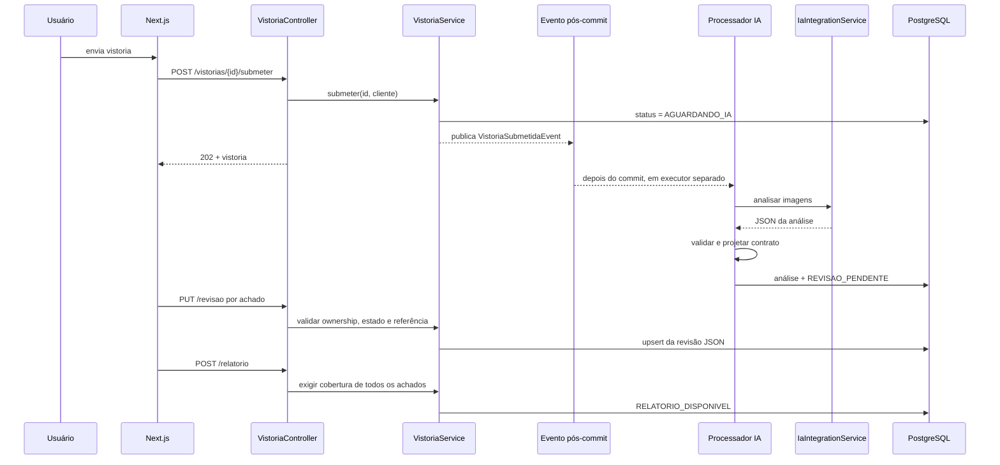
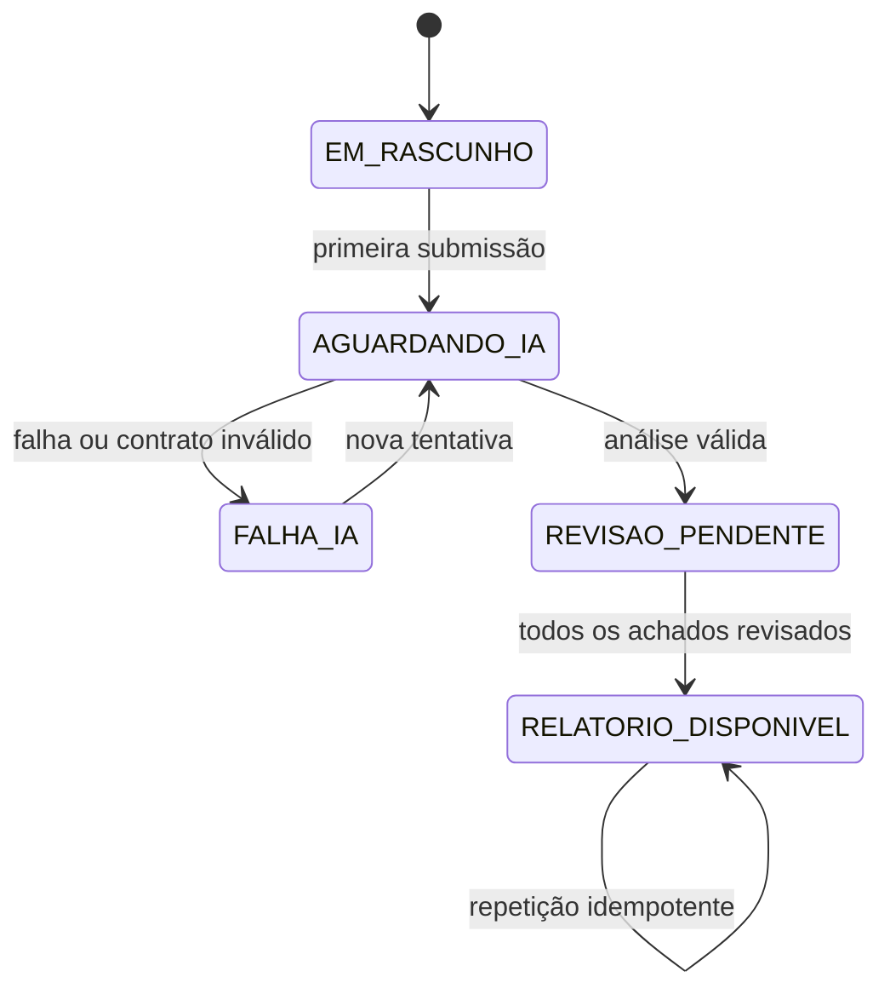

# MVP Relatório de vistoria por IA Design

**Spec**: `.specs/features/mvp-relatorio-ia/spec.md`
**Status**: Approved by delegated automatic execution

---

## Architecture Decision

Três abordagens entregariam a mesma jornada:

1. **Somente frontend sobre `preLaudoIa`** — menor mudança, mas revisão seria
   perdida ao recarregar, não haveria integridade de estado e o relatório não
   seria auditável. Rejeitada.
2. **Tabelas normalizadas para análise, achado, revisão e relatório** — melhor
   base relacional de longo prazo, mas duplica o documento retornado pelo modelo
   e aumenta migrations, mapeamentos e custo do MVP. Adiada.
3. **Projeção tipada + revisão JSON persistida** — escolhida. A resposta original
   da IA permanece imutável, o backend a valida e projeta em DTO seguro, e a
   revisão do usuário fica em JSON tipado na vistoria, com upsert por
   `imagemId + indiceAchado`.

Essa abordagem mantém o monólito modular existente, cria somente uma migration
aditiva e deixa uma fronteira clara para normalização futura.

## Architecture Overview



### State model



Estados legados permanecem no enum e no schema, mas não fazem parte dessas
transições novas.

---

## Code Reuse Analysis

### Existing Components to Leverage

| Component | Location | How to Use |
| --- | --- | --- |
| `IaIntegrationService` | `src/main/java/br/com/vistoriapredial/vistoria/application/` | Preservar como porta; mover somente a orquestração para o processador assíncrono. |
| `TransactionTemplate` | `config/TransactionTemplateConfig.java` | Manter transações curtas antes e depois do I/O externo. |
| `EvidenceFileValidator` | `vistoria/application/EvidenceFileValidator.java` | Reutilizar limites e validação de assinatura dos uploads. |
| `StorageService` | `storage/` | Preservar armazenamento e leitura autenticada de evidências. |
| `ProblemDetail` handlers | `shared/web/error/` | Mapear conflitos, acesso e relatório inválido no contrato RFC 9457. |
| `apiFetch` | `frontend/src/lib/api.ts` | Reutilizar autenticação, `ProblemDetail` e tratamento de multipart. |
| `EvidenceImage` | `frontend/src/features/inspections/shared/` | Carregar fotos autenticadas e revogar object URLs. |
| `AsyncState` e `StatusBadge` | `frontend/src/components/ui/` | Adaptar para skeletons, vazios e novos estados. |
| Protótipo IA-first | `../../../../docs/design/prototype/index.html` | Fonte da composição, tokens e microcopy principal. |

### Integration Points

| System | Integration Method |
| --- | --- |
| Banco | Migration `V7` adiciona `revisao_usuario TEXT`; `@Version` continua protegendo concorrência. |
| IA | Evento transacional pós-commit aciona listener `@Async`; a porta não muda. |
| API | DTO de vistoria passa a expor análise e revisões tipadas, nunca `storagePath` ou JSON bruto. |
| Frontend | Polling existente acompanha `AGUARDANDO_IA`; revisão e relatório usam endpoints novos. |
| Impressão/compartilhamento | APIs nativas `window.print`, `navigator.share` e Clipboard, sem dependência nova. |

---

## Backend Components

### `PreLaudoParser`

- **Purpose**: validar o JSON não confiável da IA e projetá-lo em achados ligados
  a `ImagemVistoria` sem expor o caminho de armazenamento.
- **Location**: `src/main/java/br/com/vistoriapredial/vistoria/application/analysis/`
- **Interfaces**:
  - `AnaliseVistoria parse(Vistoria vistoria, String raw)` — exige `version`,
    `images`, qualidade e no máximo 100 achados; relaciona imagens por caminho
    apenas dentro do backend.
  - `AchadoRef requireFinding(Vistoria vistoria, long imagemId, int indice)` —
    valida a referência usada na revisão.
- **Dependencies**: Jackson já fornecido pelo Spring Boot.
- **Reuses**: schema produzido por `VlmPreLaudoFormatter` e mock.

### `VistoriaAnalysisProcessor`

- **Purpose**: executar a porta de IA fora da requisição e persistir sucesso ou
  falha sem manter transação durante rede.
- **Location**: `src/main/java/br/com/vistoriapredial/vistoria/application/analysis/`
- **Interfaces**:
  - `process(Long vistoriaId)` — lê snapshot, chama IA, valida, atualiza somente
    se o estado ainda for `AGUARDANDO_IA`.
- **Dependencies**: repository, `IaIntegrationService`, parser e
  `TransactionTemplate`.
- **Reuses**: padrão atual de duas transações curtas de `VistoriaService`.

### `VistoriaAnalysisListener`

- **Purpose**: receber o evento somente depois do commit e delegar ao processador
  em executor separado.
- **Location**: `src/main/java/br/com/vistoriapredial/vistoria/application/analysis/`
- **Interfaces**:
  - `onSubmitted(VistoriaSubmetidaEvent event)` com `@Async` e
    `@TransactionalEventListener(AFTER_COMMIT)`.
- **Dependencies**: executor Spring configurado e processador.

### Revisão e conclusão em `VistoriaService`

- **Purpose**: aplicar ownership, estado, validação do achado, upsert e conclusão.
- **Location**: `src/main/java/br/com/vistoriapredial/vistoria/application/VistoriaService.java`
- **Interfaces**:
  - `revisarAchado(Long id, Usuario cliente, RevisarAchadoCommand command)`.
  - `concluirRelatorio(Long id, Usuario cliente)`.
- **Dependencies**: parser e `RevisaoAchadoStore`.
- **Reuses**: `buscarPorIdEValidarCliente` e controle otimista existente.

### DTO e mapper de vistoria

- **Purpose**: expor contrato seguro, tipado e estável para o novo frontend.
- **Location**: `src/main/java/br/com/vistoriapredial/vistoria/web/`
- **Interfaces**:
  - `VistoriaResponseMapper.toResponse(Vistoria)`.
  - `PUT /api/vistorias/{id}/revisao`.
  - `POST /api/vistorias/{id}/relatorio`.
- **Dependencies**: parser e store de revisões.
- **Reuses**: envelope paginado, autenticação e handlers existentes.

---

## Frontend Components

### `DashboardShell`

- **Purpose**: implementar navegação lateral no desktop e inferior no celular,
  sem área de engenharia na navegação principal.
- **Location**: `frontend/src/components/DashboardShell.tsx`
- **Interfaces**: `DashboardShell({ children })` usa sessão somente para conta e
  logout.
- **Reuses**: `getSession`, `removeSession`, Next `Link` e Lucide.

### `ClientDashboard` e `NewInspectionForm`

- **Purpose**: priorizar próxima ação, relatórios recentes e cadastro curto.
- **Location**: `frontend/src/features/inspections/client/`
- **Interfaces**: serviços existentes de lista e criação.
- **Reuses**: paginação, `ApiError`, `AsyncState` e rotas atuais.

### `InspectionWorkflow`

- **Purpose**: orquestrar captura, upload, acompanhamento e seleção do próximo
  estado sem concentrar a renderização de revisão e relatório.
- **Location**: `frontend/src/features/inspections/client/inspection-workflow.tsx`
- **Interfaces**: `InspectionWorkflow({ inspectionId })`.
- **Dependencies**: `CaptureWorkspace`, polling e serviços de inspeção.
- **Reuses**: validação de arquivo, `EvidenceImage` e bloqueio de submissão.

### `InspectionReview`

- **Purpose**: apresentar um achado por vez, coletar decisão/contexto e persistir
  antes de avançar.
- **Location**: `frontend/src/features/inspections/client/inspection-review.tsx`
- **Interfaces**: `InspectionReview({ inspection, onChange })`.
- **Dependencies**: análise tipada, revisões e `reviewFinding`.
- **Reuses**: `EvidenceImage`, `ApiError` e tokens do protótipo.

### `InspectionReport`

- **Purpose**: renderizar o documento rastreável e oferecer impressão e
  compartilhamento progressivo.
- **Location**: `frontend/src/features/inspections/client/inspection-report.tsx`
- **Interfaces**: `InspectionReport({ inspection })`.
- **Dependencies**: análise/revisões tipadas, `window.print`, Web Share e Clipboard.
- **Reuses**: conteúdo seguro retornado pela API.

---

## Data Models

### Persistence

```text
tb_vistoria
  revisao_usuario TEXT NULL  # JSON versionado; migration V7 aditiva
```

```java
enum DecisaoRevisao { CONFIRMADO, CORRIGIDO, REJEITADO }

record RevisaoAchado(
    long imagemId,
    int indiceAchado,
    DecisaoRevisao decisao,
    String contexto,
    String tipoCorrigido,
    Instant revisadoEm
) {}
```

O JSON tem raiz `{ "version": 1, "revisoes": [...] }`. A lista é limitada a
100 entradas, ordenada por `imagemId` e `indiceAchado` na resposta.

### HTTP response

```typescript
interface Inspection {
  id: number
  clienteId: number
  status: InspectionStatus
  endereco: string
  dataCriacao: string
  dataConclusao: string | null
  imagens: Evidence[]
  analiseIa: AiAnalysis | null
  revisoes: FindingReview[]
}

interface AiFinding {
  indice: number
  area: string | null
  tipo: string | null
  descricao: string | null
  evidencia: string | null
  gravidade: string | null
  confianca: string | null
  recomendacao: string | null
  localizacao: string | null
}
```

`Evidence` não contém `storagePath`; `AiAnalysis` usa `imagemId` como elo público.

### Review request

```json
{
  "imagemId": 14,
  "indiceAchado": 0,
  "decisao": "CORRIGIDO",
  "contexto": "A marca já existia na entrega das chaves.",
  "tipoCorrigido": "Marca superficial"
}
```

---

## Error Handling Strategy

| Error Scenario | Handling | User Impact |
| --- | --- | --- |
| IA falha ou expira | Processador persiste `FALHA_IA` em transação curta | Fotos continuam disponíveis e há ação explícita de tentar novamente. |
| JSON da IA inválido | Parser rejeita antes de persistir sucesso | Estado vira falha; nenhum achado fabricado aparece. |
| Achado inexistente | `FindingNotFoundException` → 404 ProblemDetail | A revisão atual é recarregada sem alteração silenciosa. |
| Estado incompatível | `StaleInspectionException` → 409 | UI reconcilia com a resposta mais recente. |
| Revisão incompleta | `IncompleteReviewException` → 409 | Documento não é marcado como disponível. |
| Concorrência | `OptimisticLockingFailureException` → 409 | Usuário é orientado a recarregar; não há last-write-wins invisível. |
| Compartilhamento indisponível | Fallback para Clipboard; erro persistente se ambos falharem | Nenhum toast de sucesso falso. |

---

## Risks & Concerns

| Concern | Location | Impact | Mitigation |
| --- | --- | --- | --- |
| `submeterVistoria` chama IA de forma síncrona | `VistoriaService.java` | Prende conexão HTTP e contradiz a tela assíncrona. | Evento pós-commit e listener `@Async`. |
| Frontend aceita 12 códigos, backend aceita apenas 1 | `protocol.ts` / `ProtocoloVistoria.java` | Uploads de ambientes diferentes falham. | Fonte explícita equivalente nos dois lados e testes parametrizados de todos os códigos. |
| DTO expõe `storagePath` e JSON bruto | `ImagemVistoriaResponseDto.java` / `VistoriaResponseDto.java` | Vaza detalhe interno e acopla UI ao provedor. | Mapper tipado substitui caminho por `imagemId`. |
| Entidade expõe setters amplos | `Vistoria.java` | Transições podem ocorrer fora de métodos de intenção. | Novos estados usam métodos `iniciarAnalise`, `registrarAnalise`, `falharAnalise`, `disponibilizarRelatorio`; setters legados ficam apenas por compatibilidade. |
| Código e specs legadas ainda promovem engenheiro | `.specs/features/frontend-redesign/`, `docs/architecture.md` | Documentação contradiz o produto atual. | AD-008 e atualização dos documentos de entrada nesta feature; histórico permanece identificado como legado. |
| Executor em memória perde trabalho se o processo cair | configuração assíncrona nova | Vistoria pode permanecer `AGUARDANDO_IA`. | Registrar limitação; UI mantém estado real e evolução futura usará fila durável. Não fabricar conclusão. |
| Frontend atual concentra fluxo em um componente grande | `inspection-workflow.tsx` | Manutenção e testes frágeis. | Extrair revisão e relatório; manter orquestração no workflow. |
| Teste PostgreSQL depende de Docker | `PostgreSqlMigrationIntegrationTest.java` | Gate pode bloquear em ambiente sem Docker. | Executar e reportar separadamente; H2 nunca substitui evidência PostgreSQL. |

---

## Tech Decisions

| Decision | Choice | Rationale |
| --- | --- | --- |
| Modelo de persistência da revisão | JSON versionado na vistoria | Uma única aggregate root, migration aditiva e normalização futura possível. |
| Identidade pública do achado | `imagemId + indiceAchado` | Não expõe storage, é estável para a análise imutável e simples de validar. |
| Processamento da IA | Evento transacional pós-commit + listener assíncrono | Evita corrida com o commit e I/O de rede dentro da transação. |
| Contrato do frontend | DTO tipado projetado no backend | Resposta do modelo é entrada não confiável; navegador não deve validá-la sozinho. |
| PDF do MVP | CSS de impressão + diálogo do navegador | Sem dependência nova e sem promessa de documento assinado. |
| Legado de engenharia | Preservado, mas fora da jornada principal | Migração destrutiva exige decisão e plano próprios. |

---

## Requirement Mapping

| Requirement | Design coverage |
| --- | --- |
| AIR-01 | Shell, autenticação pública e dashboard IA-first |
| AIR-02 | Roteiro comum, upload e processamento pós-commit |
| AIR-03 | Parser seguro, revisão persistida e `InspectionReview` |
| AIR-04 | Gate de conclusão e `InspectionReport` |
| AIR-05 | State model, DTO mapper, ownership e ProblemDetail |
| AIR-06 | Tokens, componentes responsivos, acessibilidade e impressão |
