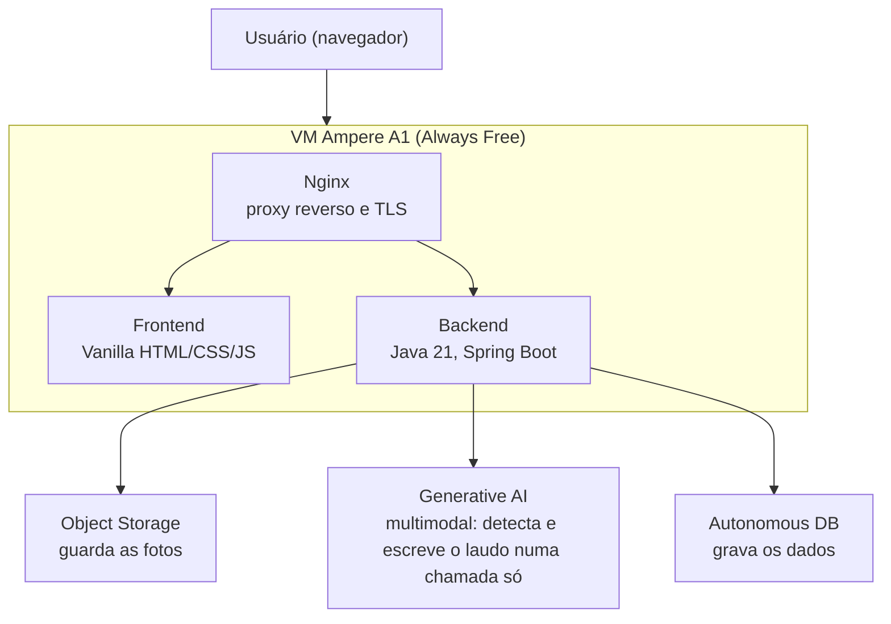
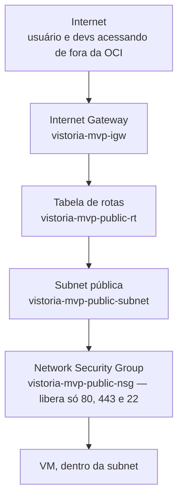
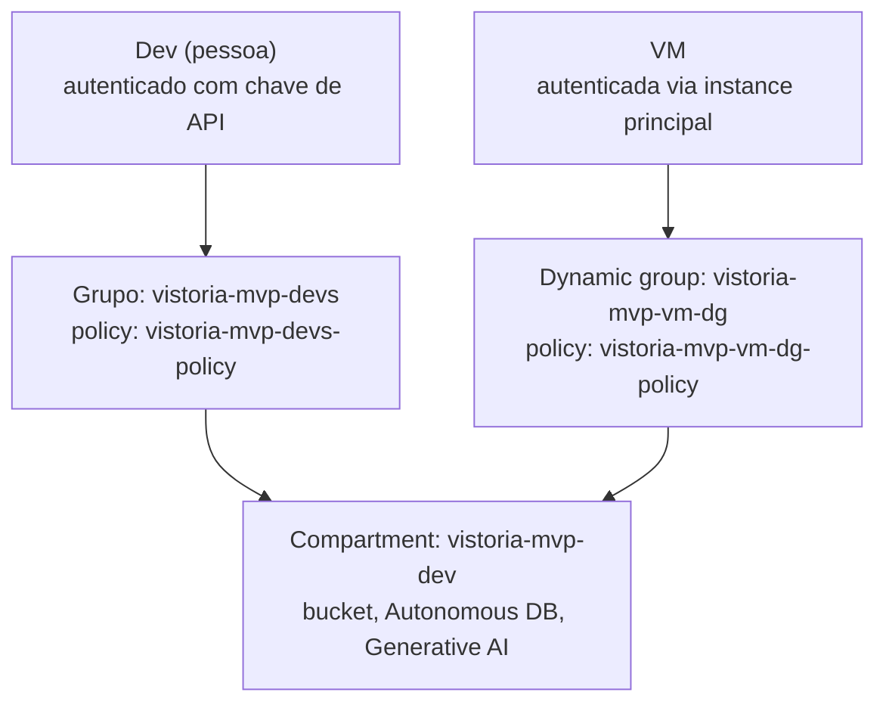

# VistoApto — infraestrutura (`infra`)

Infraestrutura como código (Terraform + Ansible) do ambiente único de
desenvolvimento e teste do VistoApto na OCI, compartilhado por todo o time.
Este repositório cobre só a infra — o código da aplicação vive em outro
repositório (`vistoria-predial`).

## Status atual

| Recurso | Status |
|---|---|
| Compartment, grupos, dynamic group, policies | ✅ criado |
| Rede (VCN, subnet, NSG, gateway) | ✅ criado |
| Bucket de fotos (Object Storage) | ✅ criado, testado |
| Autonomous Database | ✅ criado, testado (via wallet) |
| Generative AI | ⏸️ bloqueado — limite `max-on-demand-chat-request-per-minute-count = 0` da conta trial (ver [docs/onboarding-backend-dev.md](docs/onboarding-backend-dev.md)) |
| VM (Ampere A1 Always Free) | ⏸️ bloqueado — `Out of host capacity` na região `sa-saopaulo-1`, retentando |

## Arquitetura da aplicação (o que roda na VM)



## Arquitetura de rede



Portas internas do frontend e do backend nunca são publicadas no host — só a
VM recebe 80/443/22 do NSG; frontend e backend só são alcançáveis pela rede
Docker interna, atrás do nginx.

## Arquitetura de identidade e acesso



Dev e VM chegam nos mesmos recursos (bucket, Generative AI, Autonomous DB)
por dois caminhos de autenticação diferentes, mas com o mesmo escopo de
permissão — nenhum dos dois decide sozinho qual autenticação usar (ver
`OciAuthConfiguration` em `docs/spec-backend.md`).

## State do Terraform

O state remoto fica no bucket `vistoria-mvp-terraform-state` (Object
Storage), acessado via API compatível com S3 (a OCI não tem um backend
nativo `oci` no Terraform). Quem for rodar `terraform init`/`plan`/`apply`
precisa de uma **Customer Secret Key** (credencial S3-compatível, diferente
da API key usada pelo provider `oci`) e das variáveis de ambiente:

```bash
export AWS_ACCESS_KEY_ID=<access-key>
export AWS_SECRET_ACCESS_KEY=<secret-key>
export AWS_REQUEST_CHECKSUM_CALCULATION=when_required   # SDK novo da AWS não é compatível com o S3 da OCI sem isso
export AWS_RESPONSE_CHECKSUM_VALIDATION=when_required
```

Peça essa credencial ao administrador do projeto por um canal seguro. Não há
lock de state (a OCI não suporta `use_lockfile` nem DynamoDB) — evite rodar
`apply` de duas pessoas ao mesmo tempo.

## Estrutura do repositório

```
terraform/
  modules/{iam,network,storage,database,compute}/
  environments/dev/
ansible/
  playbooks/site.yml
  roles/{docker,app}/
  inventory/
scripts/smoke-tests/     # testa Object Storage, Generative AI e Autonomous DB isoladamente
docs/
  spec-*.md                     # specs originais do projeto
  onboarding-backend-dev.md     # passo a passo real de conexão pro time de backend
```

## Como aplicar

```bash
cd terraform/environments/dev
cp terraform.tfvars.example terraform.tfvars   # preencher com valores reais, nunca commitar
terraform init
terraform plan
terraform apply
```

Depois, com a VM no ar:

```bash
cd ansible/inventory
./generate-dev-ini.sh          # pega o IP da VM do output do Terraform
cd ..
ansible-playbook -i inventory/dev.ini playbooks/site.yml
```

Pré-requisitos e passo a passo completo (chave de API, wallet do banco,
testes isolados de cada serviço): ver
[docs/spec-ambiente-dev.md](docs/spec-ambiente-dev.md) e
[docs/onboarding-backend-dev.md](docs/onboarding-backend-dev.md).

## Documentação

| Arquivo | Conteúdo |
|---|---|
| [docs/spec-terraform.md](docs/spec-terraform.md) | Especificação da infra (IAM, rede, storage, banco, compute) |
| [docs/spec-ansible.md](docs/spec-ansible.md) | Especificação da configuração da VM |
| [docs/spec-ambiente-dev.md](docs/spec-ambiente-dev.md) | Como cada dev conecta no ambiente compartilhado |
| [docs/spec-backend.md](docs/spec-backend.md) | Especificação do backend/frontend (repositório da aplicação) |
| [docs/onboarding-backend-dev.md](docs/onboarding-backend-dev.md) | Valores reais do ambiente + scripts de teste + achados de compatibilidade |
